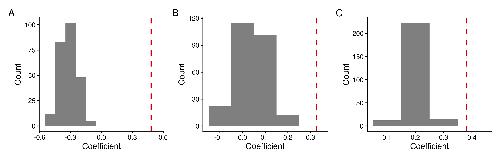
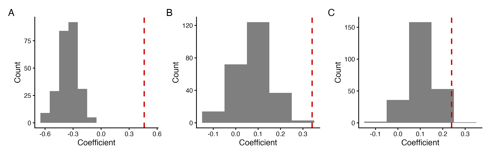
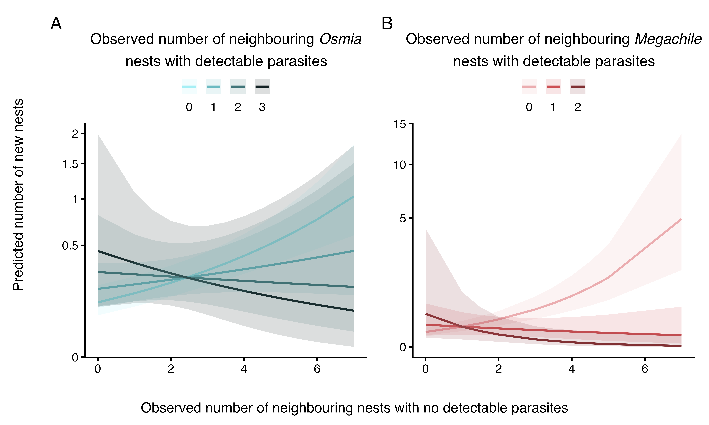

```{r Set_up, include=FALSE}

library(tidyverse)
library(broom)
library(broom.mixed)
library(flextable)
library(knitr)
library(kableExtra)
library(officer) # for boarders
library(gt) # for AIC table


# Load models
mod_1i_choice_consp_os_ps <- readRDS('Models/mod_1i_choice_consp_os_ps.rds')
mod_1ii_choice_consp_os_no_ps <- readRDS('Models/mod_1ii_choice_consp_os_no_ps.rds')
mod_1iii_choice_consp_os_active <- readRDS('Models/mod_1iii_choice_consp_os_active.rds')
mod_1iv_choice_consp_meg_ps <- readRDS('Models/mod_1iv_choice_consp_meg_ps.rds')
mod_1v_choice_consp_meg_no_ps <- readRDS('Models/mod_1v_choice_consp_meg_no_ps.rds')
mod_1vi_choice_consp_meg_active <- readRDS('Models/mod_1vi_choice_consp_meg_active.rds')
mod_2i_par_agg_os_ps <- readRDS('Models/mod_2i_par_agg_os_ps.rds')
mod_2ii_par_agg_os_no_ps <- readRDS('Models/mod_2ii_par_agg_os_no_ps.rds')
mod_2iii_par_agg_os_active <- readRDS('Models/mod_2iii_par_agg_os_active.rds')
mod_2iv_par_agg_meg_ps <- readRDS('Models/mod_2iv_par_agg_meg_ps.rds')
mod_2v_par_agg_meg_no_ps <- readRDS('Models/mod_2v_par_agg_meg_no_ps.rds')
mod_2vi_par_agg_meg_active <- readRDS('Models/mod_2vi_par_agg_meg_active.rds')
mod_3ai_choice_consp_par_os_ps <- readRDS('Models/mod_3ai_choice_consp_par_os_ps.rds')
mod_3aii_choice_consp_par_os_no_ps <- readRDS('Models/mod_3aii_choice_consp_par_os_no_ps.rds')
mod_3aiii_choice_consp_par_meg_ps <- readRDS('Models/mod_3aiii_choice_consp_par_meg_ps.rds')
mod_3aiv_choice_consp_par_meg_no_ps <- readRDS('Models/mod_3aiv_choice_consp_par_meg_no_ps.rds')
mod_3bi_invest_filled_os <- readRDS('Models/mod_3bi_invest_filled_os.rds')
mod_3bii_invest_filled_meg <- readRDS('Models/mod_3bii_invest_filled_meg.rds')
mod_3ci_last_cell_os <- readRDS('Models/mod_3ci_last_cell_os.rds')
mod_3cii_last_cell_meg <- readRDS('Models/mod_3cii_last_cell_meg.rds')
mod_3di_inner_wall_os <- readRDS('Models/mod_3di_inner_wall_os.rds')
# mod_3dii_inner_wall_meg <- readRDS('Models/mod_3dii_inner_wall_meg.rds')

# for extra figures
nesting_cells_os <- read_csv('data/nesting_cells_cleaned_osmia.csv')
nesting_cells_os <- nesting_cells_os %>% filter(Year != 'year_2024')
nesting_cells_os <- nesting_cells_os %>% filter(Site != 'CP')
trapnesting_meg <- read_csv('data/trapnesting_cleaned_megachile.csv')
trapnesting_meg <- trapnesting_meg %>% filter(Site != 'NN')


```

```{r Tidy_Tables, include=FALSE}

## Create functions 

# make a function that makes nice table with 2 decimal places, rounds them, makes the small numbers use exponents, and the p-value column to say < 0.0001 
tidy_function_glmer <- function(model) {
  tidy(model) %>%
    mutate(
      across(
        c(estimate, std.error, statistic),
        ~ case_when(
            is.na(.) ~ NA, # NA is NA 
            . == 0 ~ '0', # true zeros should be 0 not 0.00
            abs(.) < 0.01 ~ formatC(., format = 'e', digits = 2), # tiny numbers
            TRUE ~ sprintf('%.2f', .) # everything else should have 2 numbers after decimal
        )
      ),
      # keep numeric p-value for comparisons
      p.value.num = p.value,
      # create formatted p-value text
      p.value = case_when(
        is.na(p.value.num) ~ ' ',
        p.value.num < 0.0001 ~ '< 0.0001',
        p.value.num < 0.001  ~ '< 0.001',
        p.value.num < 0.01   ~ '< 0.01',
        TRUE ~ sprintf('%.2f', p.value.num)
      ),
      # now add stars based on numeric p-value
      p.value = paste0(
        p.value,
        case_when(
          is.na(p.value.num) ~ ' ',
          p.value.num < 0.0001 ~ ' ***',
          p.value.num < 0.001  ~ ' **',
          p.value.num < 0.05   ~ ' *',
          TRUE ~ ''
        )
      )
    ) %>%
    select(-p.value.num) # remove temporary numeric column
}


tidy_function_lmer <- function(model) {
  tidy(model) %>%
    mutate(
      across(
        c(estimate, std.error, df, statistic),
        ~ case_when(
          is.na(.) ~ NA, # NA is NA 
          . == 0 ~ '0', # true zeros should be 0 not 0.00
          abs(.) < 0.01 ~ formatC(., format = 'e', digits = 2), # tiny numbers
          TRUE ~ sprintf('%.2f', .) # everything else 2 decimals
        )
      ),
      # keep numeric p-value for comparisons
      p.value.num = p.value,
      # create formatted p-value text
      p.value = case_when(
        is.na(p.value.num) ~ ' ',
        p.value.num < 0.0001 ~ '< 0.0001',
        p.value.num < 0.001  ~ '< 0.001',
        p.value.num < 0.01   ~ '< 0.01',
        TRUE ~ sprintf('%.2f', p.value.num)
      ),
      # now add stars based on p-value
      p.value = paste0(
        p.value,
        case_when(
          is.na(p.value.num) ~ ' ',
          p.value.num < 0.0001 ~ ' ***',
          p.value.num < 0.001  ~ ' **',
          p.value.num < 0.05   ~ ' *',
          TRUE ~ ''
        )
      )
    ) %>%
    select(-p.value.num) # remove temporary numeric column
}


# make table format funciton for all tables for glmer, make functon to replace sd__(Intercept) with the nested random effects, rename columns, rename ran_pars
format_table_function_glmer <- function(df) {
  df %>%
    mutate(term_2 = ifelse(term == 'sd__(Intercept)', group, term)) %>%
    select(-term, -group) %>%
    rename(
      Effect = effect,
      Variable = term_2,
      Estimate = estimate,
      'Std. Error' = std.error,
      'Z Value' = statistic,
      'P-Value' = p.value
    ) %>%
    relocate(last_col(), .after = 1) %>% 
  mutate(
    Effect = dplyr::recode(Effect,
                             'ran_pars' = 'random')
    )
}


# same with lmer
format_table_function_lmer <- function(df) {
  df %>%
    mutate(term_2 = ifelse(term == 'sd__(Intercept)', group, term)) %>%
    select(-term, -group) %>%
    rename(
      Effect = effect,
      Variable = term_2,
      Estimate = estimate,
      'Std. Error' = std.error,
      'T Value' = statistic,
      'DF' = df,
      'P-Value' = p.value
    ) %>%
    relocate(last_col(), .after = 1) %>% 
  mutate(
    Effect = dplyr::recode(Effect,
                             'ran_pars' = 'random')
    )
}


# make function for renaming variables for glmer
format_table_function_terms <- function(df) {
  df %>%
    mutate(
      Variable = dplyr::recode(Variable,
                               '(Intercept)' = 'Intercept',
                               'scale(Osmia_ps_prior)' = 'Number of neighbouring congeneric nests, including pseudo nests',
                               'scale(Osmia_no_ps_prior)' = 'Number of neighbouring congeneric nests, excluding pseudo nests',
                               'scale(Meg_ps_prior)' = 'Number of neighbouring congeneric nests, including pseudo nests',
                               'scale(Meg_no_ps_prior)' = 'Number of neighbouring congeneric nests excluding pseudo nests',
                               'scale(Good_days)' = 'Number of days with appropriate weather for bee activity',
                               'scale(DP_os_prior)' = 'Number of neighbouring congeneric nests with detectable parasites',
                               'scale(NDP_os_prior)' = 'Number of neighbouring congeneric nests with no detectable parasites, excluding pseudo nests',
                               'scale(NDP_ps_os_prior)' = 'Number of neighbouring congeneric nests with no detectable parasites',
                               'scale(Osmia_active_mothers_prior)' = 'Number of active neighbouring congeneric nests',
                               'scale(Meg_active_mothers_prior)' = 'Number of active neighbouring congeneric nests',
                               'scale(DP_os_prior):scale(NDP_ps_os_prior)' = 'Number of neighbouring congeneric nests with detectable parasites * Number of neighbouring congeneric nests with no detectable parasites, including pseudo nests',
                               'scale(DP_os_prior):scale(NDP_os_prior)' = 'Number of neighbouring congeneric nests with detectable parasites * Number of neighbouring congeneric nests with no detectable parasites, excluding pseudo nests',
                               'scale(DP_meg_prior)' = 'Number of neighbouring congeneric nests with detectable parasites',
                               'scale(NDP_meg_prior)' = 'Number of neighbouring congeneric nests with no detectable parasites, excluding pseudo nests',
                               'scale(NDP_ps_meg_prior)' = 'Number of neighbouring congeneric nests with no detectable parasites',
                               'scale(DP_meg_prior):scale(NDP_ps_meg_prior)' = 'Number of neighbouring congeneric nests with detectable parasites * Number of neighbouring congeneric nests with no detectable parasites, including pseudo nests',
                               'scale(DP_meg_prior):scale(NDP_meg_prior)' = 'Number of neighbouring congeneric nests with detectable parasites * Number of neighbouring congeneric nests with no detectable parasites, excluding pseudo nests',
                               'Cell_parasitized' = 'Cell parasitism',
                               'Nest_parasitizedparasitized' = 'Nest parasitism (parasitized)',
                               'scale(DP_os_prior):Nest_parasitizedparasitized' = 'Number of neighbouring Osmia nests with detectable parasites * Nest parasitism (parasitized)',
                               'scale(DP_meg_prior):Nest_parasitizedparasitized' = 'Number of neighbouring congeneric nests with detectable parasites * Nest parasitism (parasitized)',
                               'poly(Day_of_year, 2)1' = 'Day of year I: linear effect',
                               'poly(Day_of_year, 2)2' = 'Day of year II: quadratic effect',
                               'Yearyear_2024' = 'Year (2024)',
                               'SiteCP' = 'Site (CP)',
                               'SiteNN' = 'Site (NN)',
                               'Nest_ID:Trapnest:Subsite' = 'Nest ID: Nest-box: Subsite',
                               'Trapnest:Subsite' = 'Nest-box: Subsite'
   )
 )
} 

# make different labels for parasite one
format_table_function_terms_par <- function(df) {
  df %>%
    mutate(
      Variable = dplyr::recode(Variable,
                               '(Intercept)' = 'Intercept',
                               'scale(Osmia_ps)' = 'Number of host nests, including pseudo nests',
                               'scale(Osmia_no_ps)' = 'Number of host nests, excluding pseudo nests',
                               'scale(Meg_ps)' = 'Number of host nests, including pseudo nests',
                               'scale(Meg_no_ps)' = 'Number of host nests, excluding pseudo nests',
                               'scale(Osmia_active_mothers)' = 'Number of active host mothers',
                               'scale(Meg_active_mothers)' = 'Number of active host mothers',
                               'Cell_parasitized' = 'Cell parasitism',
                               'Nest_parasitizedparasitized' = 'Focal nest parasitism (parasitized)',
                               'scale(DP_os_prior):Nest_parasitizedparasitized' = 'Number of host nests with detectable parasites * Focal nest parasitism (parasitized)',
                               'scale(DP_meg_prior):Nest_parasitizedparasitized' = 'Number of neighbouring host nests with detectable parasites * Focal nest parasitism (parasitized)',
                               'poly(Day_of_year, 2)1' = 'Day of year I: linear effect',
                               'poly(Day_of_year, 2)2' = 'Day of year II: quadratic effect',
                               'Yearyear_2024' = 'Year (2024)',
                               'SiteCP' = 'Site (CP)',
                               'SiteNN' = 'Site (NN)',
                               'Nest_ID:Trapnest:Subsite' = 'Nest ID: Nest-box: Subsite',
                               'Trapnest:Subsite' = 'Nest-box: Subsite'
   )
 )
} 


## Apply functions

# P1 - glmer
mod_1i_choice_consp_os_ps_table <- tidy_function_glmer(mod_1i_choice_consp_os_ps) %>%
  format_table_function_glmer %>% 
  format_table_function_terms()
mod_1ii_choice_consp_os_no_ps_table <- tidy_function_glmer(mod_1ii_choice_consp_os_no_ps) %>%
  format_table_function_glmer %>% 
  format_table_function_terms()
mod_1iii_choice_consp_os_active_table <- tidy_function_glmer(mod_1iii_choice_consp_os_active) %>%
  format_table_function_glmer %>% 
  format_table_function_terms()
mod_1iv_choice_consp_meg_ps_table <- tidy_function_glmer(mod_1iv_choice_consp_meg_ps) %>%
  format_table_function_glmer %>% 
  format_table_function_terms()
mod_1v_choice_consp_meg_no_ps_table <- tidy_function_glmer(mod_1v_choice_consp_meg_no_ps) %>%
  format_table_function_glmer %>% 
  format_table_function_terms()
mod_1vi_choice_consp_meg_active_table <- tidy_function_glmer(mod_1vi_choice_consp_meg_active) %>%
  format_table_function_glmer %>% 
  format_table_function_terms()

# P2 - glmer and parasites
mod_2i_par_agg_os_ps_table <- tidy_function_glmer(mod_2i_par_agg_os_ps) %>%
  format_table_function_glmer %>% 
  format_table_function_terms_par() 
mod_2ii_par_agg_os_no_ps_table <- tidy_function_glmer(mod_2ii_par_agg_os_no_ps) %>%
  format_table_function_glmer %>% 
  format_table_function_terms_par()
mod_2iii_par_agg_os_active_table <- tidy_function_glmer(mod_2iii_par_agg_os_active) %>%
  format_table_function_glmer %>% 
  format_table_function_terms_par() 
mod_2iv_par_agg_meg_ps_table <- tidy_function_glmer(mod_2iv_par_agg_meg_ps) %>%
  format_table_function_glmer %>% 
  format_table_function_terms_par()
mod_2v_par_agg_meg_no_ps_table <- tidy_function_glmer(mod_2v_par_agg_meg_no_ps) %>%
  format_table_function_glmer %>% 
  format_table_function_terms_par()
mod_2vi_par_agg_meg_active_table <- tidy_function_glmer(mod_2vi_par_agg_meg_active) %>%
  format_table_function_glmer %>% 
  format_table_function_terms_par()

# P3 - glmer
mod_3ai_choice_consp_par_os_ps_table <- tidy_function_glmer(mod_3ai_choice_consp_par_os_ps) %>%
  format_table_function_glmer %>% 
  format_table_function_terms()
mod_3aii_choice_consp_par_os_no_ps_table <- tidy_function_glmer(mod_3aii_choice_consp_par_os_no_ps) %>%
  format_table_function_glmer %>% 
  format_table_function_terms()
mod_3aiii_choice_consp_par_meg_ps_table <- tidy_function_glmer(mod_3aiii_choice_consp_par_meg_ps) %>%
  format_table_function_glmer %>% 
  format_table_function_terms()
mod_3aiv_choice_consp_par_meg_no_ps_table <- tidy_function_glmer(mod_3aiv_choice_consp_par_meg_no_ps) %>%
  format_table_function_glmer %>% 
  format_table_function_terms()
mod_3ci_last_cell_os_table <- tidy_function_glmer(mod_3ci_last_cell_os) %>%
  format_table_function_glmer %>% 
  format_table_function_terms()
mod_3cii_last_cell_meg_table <- tidy_function_glmer(mod_3cii_last_cell_meg) %>%
  format_table_function_glmer %>% 
  format_table_function_terms()
mod_3di_inner_wall_os_table <- tidy_function_glmer(mod_3di_inner_wall_os) %>%
  format_table_function_glmer %>% 
  format_table_function_terms()

# P3 - lmer
mod_3bi_invest_filled_os_table <- tidy_function_lmer(mod_3bi_invest_filled_os) %>%
  format_table_function_lmer %>% 
  format_table_function_terms() 
mod_3bii_invest_filled_meg_table <- tidy_function_lmer(mod_3bii_invest_filled_meg) %>%
    format_table_function_lmer %>% 
  format_table_function_terms()


```

**Table S6.** AIC values from analyses with multiple observed-data models (which accounted for pseudo nests or active nests). Within each prediction–genus group, models with the lowest AIC values (including models within 2 AIC units of the minimum value) are in bold. Statistical summaries corresponding to these models are in Tables S7-S22. For the comprehensive description of how occupied cavities are considered in the models, see *Statistical Analyses* and Table S5.

```{r AIC_Table, echo=FALSE}


## Make AIC Table

# first, extract all AIC values
mod_1i_AIC <- AIC(mod_1i_choice_consp_os_ps)
mod_1ii_AIC <- AIC(mod_1ii_choice_consp_os_no_ps)
mod_1iii_AIC <- AIC(mod_1iii_choice_consp_os_active)
mod_1iv_AIC <- AIC(mod_1iv_choice_consp_meg_ps)
mod_1v_AIC <- AIC(mod_1v_choice_consp_meg_no_ps)
mod_1vi_AIC <- AIC(mod_1vi_choice_consp_meg_active)
mod_2i_AIC <- AIC(mod_2i_par_agg_os_ps)
mod_2ii_AIC <- AIC(mod_2ii_par_agg_os_no_ps)
mod_2iii_AIC <- AIC(mod_2iii_par_agg_os_active)
mod_2iv_AIC <- AIC(mod_2iv_par_agg_meg_ps)
mod_2v_AIC <- AIC(mod_2v_par_agg_meg_no_ps)
mod_2vi_AIC <- AIC(mod_2vi_par_agg_meg_active)
mod_3ai_AIC <- AIC(mod_3ai_choice_consp_par_os_ps)
mod_3aii_AIC <- AIC(mod_3aii_choice_consp_par_os_no_ps)
mod_3aiii_AIC <- AIC(mod_3aiii_choice_consp_par_meg_ps)
mod_3aiv_AIC <- AIC(mod_3aiv_choice_consp_par_meg_no_ps)


# make the table

AIC_table <- tibble(
  Prediction = c(
    "1. Congeneric attraction", rep("", 5),
    "2. Parasitism risk in aggregations", rep("", 5),
    "3a. Avoidance of parasites", rep("", 3)
  ),
  `Focal subjects` = c(
    "Osmia", rep("", 2), "Megachile", rep("", 2),
    "Osmia", rep("", 2), "Megachile", rep("", 2),
    "Osmia", "", "Megachile", ""
  ),
  `Model` = c(
    "1_i","1_ii","1_iii","1_iv","1_v","1_vi",
    "2_i","2_ii","2_iii","2_iv","2_v","2_vi",
    "3a_i","3a_ii","3a_iii","3a_iv"
  ),
  `Predictor variable (bee nests)` = c(
    "including pseudo nests","excluding pseudo nests","active nests",
    "including pseudo nests","excluding pseudo nests","active nests",
    "including pseudo nests","excluding pseudo nests","active nests",
    "including pseudo nests","excluding pseudo nests","active nests",
    "including pseudo nests","excluding pseudo nests",
    "including pseudo nests","excluding pseudo nests"
  ),
  AIC = round(c(
  mod_1i_AIC, mod_1ii_AIC, mod_1iii_AIC, mod_1iv_AIC, mod_1v_AIC, mod_1vi_AIC,
  mod_2i_AIC, mod_2ii_AIC, mod_2iii_AIC, mod_2iv_AIC, mod_2v_AIC, mod_2vi_AIC,
  mod_3ai_AIC, mod_3aii_AIC, mod_3aiii_AIC, mod_3aiv_AIC
), 2))


# define groups for models
groups <- c(
  rep("1_osmia", 3), rep("1_megachile", 3),
  rep("2_osmia", 3), rep("2_megachile", 3),
  rep("3a_osmia", 2), rep("3a_megachile", 2)
)

# add group column
AIC_table$Group <- groups

# make list for models 2 AIC units of the best model in each group
lowest_rows <- AIC_table %>%
  group_by(Group) %>%
  mutate(min_AIC = min(AIC)) %>%
  filter(AIC <= min_AIC + 2) %>%
  pull(Model)

# remove helper column
AIC_table <- AIC_table %>% select(-Group)

# create table
AIC_table <- flextable(AIC_table)

# now make those best ones bold
AIC_table <- bold(
  AIC_table,
  j = "AIC",
  i = ~ Model %in% lowest_rows,
  bold = TRUE
)

# make names italic
AIC_table <- italic(
  AIC_table,
  j = "Focal subjects",
  i = ~ `Focal subjects` %in% c("Osmia", "Megachile"),
  italic = TRUE
)
# remove all borders 
AIC_table <- border_remove(AIC_table)
# add in all horontoal lines
AIC_table <- hline(
  AIC_table,
  part = "body",
  border = officer::fp_border(color = "black", width = 0.5)
)

AIC_table <- hline(
  AIC_table,
  part = "header",
  border = officer::fp_border(color = "black", width = 1)
)
AIC_table <- font(AIC_table, fontname = 'Times New Roman', part = 'all') %>%
  fontsize(size = 12, part = 'all') %>% 
  bold(part = 'header', bold = TRUE)
# make table take up full width of word doc
AIC_table <- AIC_table %>% width(j = c('Prediction', 'Focal subjects', 'Model', 'Predictor variable (bee nests)', 'AIC'), width = c(1.5, 1.2, .9, 1.9, 1))

AIC_table 

# cannot figure out how to merge the cells, so will manually do this after rendering for the ms

```

**Table S7.** Summary of the Poisson GLMM of the number of new *Osmia* nests, using the observed data for prediction 1, testing for an attraction to congenerics in nesting *Osmia* including pseudo nests as congenerics (model 1_i), n = 161 nests. Asterisks indicate significance for all tables. The estimate (slope), error and associated statistics are reported for fixed effects, while the estimate for the random effects is the variance component.

```{r Model_1_i, echo=FALSE}


# create table
mod_1i_table <- flextable(mod_1i_choice_consp_os_ps_table)
# remove all borders 
mod_1i_table <- border_remove(mod_1i_table)
# add only top and bottom horizontal lines 
mod_1i_table <- hline_top(mod_1i_table, part = 'all',
                border = officer::fp_border(color = 'black', width = 1))
mod_1i_table <- hline_bottom(mod_1i_table, part = 'all',
                   border = officer::fp_border(color = 'black', width = 1))
# set Times New Roman font 
mod_1i_table <- font(mod_1i_table, fontname = 'Times New Roman', part = 'all') %>%
  fontsize(size = 12, part = 'all') %>% 
  bold(part = 'header', bold = TRUE)
# set width
mod_1i_table <- mod_1i_table %>% width(j = c('Effect', 'Variable', 'Estimate', 'Std. Error', 'Z Value', 'P-Value'), width = c(.7, 2.6, .8, .8, .8, 1.1))


mod_1i_table

```

**Table S8.** Summary of the Poisson GLMM of the number of new *Osmia* nests, using the observed data for prediction 1, testing for an attraction to congenerics in nesting *Osmia* excluding pseudo nests as congenerics (model 1_ii), n = 161 nests.

```{r Model_1_ii, echo=FALSE}


# create table
mod_1ii_table <- flextable(mod_1ii_choice_consp_os_no_ps_table)
# remove all borders 
mod_1ii_table <- border_remove(mod_1ii_table)
# add only top and bottom horizontal lines 
mod_1ii_table <- hline_top(mod_1ii_table, part = 'all',
                border = officer::fp_border(color = 'black', width = 1))
mod_1ii_table <- hline_bottom(mod_1ii_table, part = 'all',
                   border = officer::fp_border(color = 'black', width = 1))
# set Times New Roman font 
mod_1ii_table <- font(mod_1ii_table, fontname = 'Times New Roman', part = 'all') %>%
  fontsize(size = 12, part = 'all') %>% 
  bold(part = 'header', bold = TRUE)
# set width
mod_1ii_table <- mod_1ii_table %>% width(j = c('Effect', 'Variable', 'Estimate', 'Std. Error', 'Z Value', 'P-Value'), width = c(.7, 2.6, .8, .8, .8, 1.1))


mod_1ii_table

```

**Table S9.** Summary of the Poisson GLMM of the number of new *Osmia* nests, using the observed data for prediction 1, testing for an attraction to active congeneric nests in nesting *Osmia* (model 1_iii), n = 161 nests.

```{r Model_1_iii, echo=FALSE}


# create table
mod_1iii_table <- flextable(mod_1iii_choice_consp_os_active_table)
# remove all borders 
mod_1iii_table <- border_remove(mod_1iii_table)
# add only top and bottom horizontal lines 
mod_1iii_table <- hline_top(mod_1iii_table, part = 'all',
                border = officer::fp_border(color = 'black', width = 1))
mod_1iii_table <- hline_bottom(mod_1iii_table, part = 'all',
                   border = officer::fp_border(color = 'black', width = 1))
# set Times New Roman font 
mod_1iii_table <- font(mod_1iii_table, fontname = 'Times New Roman', part = 'all') %>%
  fontsize(size = 12, part = 'all') %>% 
  bold(part = 'header', bold = TRUE)
# set width
mod_1iii_table <- mod_1iii_table %>% width(j = c('Effect', 'Variable', 'Estimate', 'Std. Error', 'Z Value', 'P-Value'), width = c(.7, 2.6, .8, .8, .8, 1.1))


mod_1iii_table

```

```{r Model_1_os_fig, echo=FALSE}



```

**Figure S2.** Coefficients from the Poisson GLMMs of the number of new *Osmia* nests, for prediction 1 using simulated data (grey bars) and observed data (vertical red dashed line) for the number of neighbouring congeneric nests (A) including pseudo nests (model 1_i), (B) excluding pseudo nests (model 1_ii), and (C) including only active nests (model 1_iii).

**Table S10.** Summary of the Poisson GLMM of the number of new *Megachile* nests, using the observed data for prediction 1, testing for an attraction to congenerics in nesting *Megachile* including pseudo nests as congenerics (model 1_iv), n = 137 nests.

```{r Model_1_iv, echo=FALSE}


# create table
mod_1iv_table <- flextable(mod_1iv_choice_consp_meg_ps_table)
# remove all borders 
mod_1iv_table <- border_remove(mod_1iv_table)
# add only top and bottom horizontal lines 
mod_1iv_table <- hline_top(mod_1iv_table, part = 'all',
                border = officer::fp_border(color = 'black', width = 1))
mod_1iv_table <- hline_bottom(mod_1iv_table, part = 'all',
                   border = officer::fp_border(color = 'black', width = 1))
# set Times New Roman font 
mod_1iv_table <- font(mod_1iv_table, fontname = 'Times New Roman', part = 'all') %>%
  fontsize(size = 12, part = 'all') %>% 
  bold(part = 'header', bold = TRUE)
# set width
mod_1iv_table <- mod_1iv_table %>% width(j = c('Effect', 'Variable', 'Estimate', 'Std. Error', 'Z Value', 'P-Value'), width = c(.7, 2.6, .8, .8, .8, 1.1))


mod_1iv_table

```

**Table S11.** Summary of the Poisson GLMM of the number of new nests, using the observed data for prediction 1, testing for an attraction to congenerics in nesting *Megachile* excluding pseudo nests as congenerics (model 1_v), n = 137 nests.

```{r Model_1_v, echo=FALSE}


# create table
mod_1v_table <- flextable(mod_1v_choice_consp_meg_no_ps_table)
# remove all borders 
mod_1v_table <- border_remove(mod_1v_table)
# add only top and bottom horizontal lines 
mod_1v_table <- hline_top(mod_1v_table, part = 'all',
                border = officer::fp_border(color = 'black', width = 1))
mod_1v_table <- hline_bottom(mod_1v_table, part = 'all',
                   border = officer::fp_border(color = 'black', width = 1))
# set Times New Roman font 
mod_1v_table <- font(mod_1v_table, fontname = 'Times New Roman', part = 'all') %>%
  fontsize(size = 12, part = 'all') %>% 
  bold(part = 'header', bold = TRUE)
# set width
mod_1v_table <- mod_1v_table %>% width(j = c('Effect', 'Variable', 'Estimate', 'Std. Error', 'Z Value', 'P-Value'), width = c(.7, 2.6, .8, .8, .8, 1.1))


mod_1v_table

```

**Table S12.** Summary of the Poisson GLMM of the number of new *Megachile* nests, using the observed data for prediction 1, testing for an attraction to active congeneric nests in nesting *Megachile* (model 1_vi), n = 137 nests.

```{r Model_1_vi, echo=FALSE}


# create table
mod_1vi_table <- flextable(mod_1vi_choice_consp_meg_active_table)
# remove all borders 
mod_1vi_table <- border_remove(mod_1vi_table)
# add only top and bottom horizontal lines 
mod_1vi_table <- hline_top(mod_1vi_table, part = 'all',
                border = officer::fp_border(color = 'black', width = 1))
mod_1vi_table <- hline_bottom(mod_1vi_table, part = 'all',
                   border = officer::fp_border(color = 'black', width = 1))
# set Times New Roman font 
mod_1vi_table <- font(mod_1vi_table, fontname = 'Times New Roman', part = 'all') %>%
  fontsize(size = 12, part = 'all') %>% 
  bold(part = 'header', bold = TRUE)
# set width
mod_1vi_table <- mod_1vi_table %>% width(j = c('Effect', 'Variable', 'Estimate', 'Std. Error', 'Z Value', 'P-Value'), width = c(.7, 2.6, .8, .8, .8, 1.1))


mod_1vi_table

```

```{r Model_1_meg_fig, echo=FALSE}



```

**Figure S3.** Coefficients from the Poisson GLMMs of the number of new *Megachile* nests, for prediction 1 using simulated data (grey bars) and observed data (vertical red dashed line) for the number of neighbouring congeneric nests (A) including pseudo nests (model 1_iv), (B) excluding pseudo nests (model 1_v), and (C) including only active nests (model 1_vi).

**Table S13.** Summary of the binomial GLMM of *Osmia* cell parasitism status (0 for unparasitized, 1 for parasitized) for prediction 2, testing if parasites (*Sapyga*, *Melittobia*) are attracted to *Osmia* aggregations, including pseudo nests as hosts (model 2_i), n = 287 cells.

```{r Model_2_i, echo=FALSE}

# create table
mod_2i_table <- flextable(mod_2i_par_agg_os_ps_table)
# remove all borders 
mod_2i_table <- border_remove(mod_2i_table)
# add only top and bottom horizontal lines 
mod_2i_table <- hline_top(mod_2i_table, part = 'all',
                border = officer::fp_border(color = 'black', width = 1))
mod_2i_table <- hline_bottom(mod_2i_table, part = 'all',
                   border = officer::fp_border(color = 'black', width = 1))
# set Times New Roman font 
mod_2i_table <- font(mod_2i_table, fontname = 'Times New Roman', part = 'all') %>%
  fontsize(size = 12, part = 'all') %>% 
  bold(part = 'header', bold = TRUE)
# set width
mod_2i_table <- mod_2i_table %>% width(j = c('Effect', 'Variable', 'Estimate', 'Std. Error', 'Z Value', 'P-Value'), width = c(.7, 2.6, .8, .8, .8, 1.1))
# # bold rows with significant p-value
# mod_2i_table <- mod_2i_table %>% bold(i = ~ as.numeric(gsub('[^0-9\\.]', '', `P-Value`)) < 0.05, bold = TRUE, part = 'body')

mod_2i_table

```

**Table S14.** Summary of the binomial GLMM of *Osmia* cell parasitism status (0 for unparasitized, 1 for parasitized) for prediction 2, testing if parasites (*Sapyga*, *Melittobia*) are attracted to *Osmia* aggregations, excluding pseudo nests as hosts (model 2_ii), n = 287 cells.

```{r Model_2_ii, echo=FALSE}

# create table
mod_2ii_table <- flextable(mod_2ii_par_agg_os_no_ps_table) 

# remove all borders 
mod_2ii_table <- border_remove(mod_2ii_table)
# add only top and bottom horizontal lines 
mod_2ii_table <- hline_top(mod_2ii_table, part = 'all',
                border = officer::fp_border(color = 'black', width = 1))
mod_2ii_table <- hline_bottom(mod_2ii_table, part = 'all',
                   border = officer::fp_border(color = 'black', width = 1))
# set Times New Roman font 
mod_2ii_table <- font(mod_2ii_table, fontname = 'Times New Roman', part = 'all') %>%
  fontsize(size = 12, part = 'all') %>% 
  bold(part = 'header', bold = TRUE) 
# set width
mod_2ii_table <- mod_2ii_table %>% width(j = c('Effect', 'Variable', 'Estimate', 'Std. Error', 'Z Value', 'P-Value'), width = c(.7, 2.5, .8, .8, .8, 1.2))
# # bold rows with significant p-value
# mod_2ii_table <- mod_2ii_table %>% bold(i = ~ as.numeric(gsub('[^0-9\\.]', '', `P-Value`)) < 0.05, bold = TRUE, part = 'body')

mod_2ii_table

```

**Table S15.** Summary of the binomial GLMM of *Osmia* cell parasitism status (0 for unparasitized, 1 for parasitized) for prediction 2, testing if parasites (*Sapyga*, *Melittobia*) are attracted to active *Osmia* nests (model 2_iii), n = 287 cells.

```{r Model_2_iii, echo=FALSE}
 
# create table
mod_2iii_table <- flextable(mod_2iii_par_agg_os_active_table)
# remove all borders 
mod_2iii_table <- border_remove(mod_2iii_table)
# add only top and bottom horizontal lines 
mod_2iii_table <- hline_top(mod_2iii_table, part = 'all',
                border = officer::fp_border(color = 'black', width = 1))
mod_2iii_table <- hline_bottom(mod_2iii_table, part = 'all',
                   border = officer::fp_border(color = 'black', width = 1))
# set Times New Roman font 
mod_2iii_table <- font(mod_2iii_table, fontname = 'Times New Roman', part = 'all') %>%
  fontsize(size = 12, part = 'all') %>% 
  bold(part = 'header', bold = TRUE)
# set width
mod_2iii_table <- mod_2iii_table %>% width(j = c('Effect', 'Variable', 'Estimate', 'Std. Error', 'Z Value', 'P-Value'), width = c(.7, 2.5, .8, .8, .8, 1.2)) 
# # bold rows with significant p-value
# mod_2iii_table <- mod_2iii_table %>% bold(i = ~ as.numeric(gsub('[^0-9\\.]', '', `P-Value`)) < 0.05, bold = TRUE, part = 'body')

mod_2iii_table

```

**Table S16.** Summary of the binomial GLMM of *Megachile* cell parasitism status (0 for unparasitized, 1 for parasitized) for prediction 2, testing if parasites (*Coelioxys,* meloid beetles, *Melittobia*, and other chalcid wasps) are attracted to *Megachile* aggregations, including pseudo nests as hosts (model 2_iv), n = 142 cells.

```{r Model_2_iv, echo=FALSE}

# create table
mod_2iv_table <- flextable(mod_2iv_par_agg_meg_ps_table)
# remove all borders 
mod_2iv_table <- border_remove(mod_2iv_table)
# add only top and bottom horizontal lines 
mod_2iv_table <- hline_top(mod_2iv_table, part = 'all',
                border = officer::fp_border(color = 'black', width = 1))
mod_2iv_table <- hline_bottom(mod_2iv_table, part = 'all',
                   border = officer::fp_border(color = 'black', width = 1))
# set Times New Roman font 
mod_2iv_table <- font(mod_2iv_table, fontname = 'Times New Roman', part = 'all') %>%
  fontsize(size = 12, part = 'all') %>% 
  bold(part = 'header', bold = TRUE)
# width
mod_2iv_table <- mod_2iv_table %>% width(j = c('Effect', 'Variable', 'Estimate', 'Std. Error', 'Z Value', 'P-Value'), width = c(.7, 2.5, .8, .8, .8, 1.2))
# # bold rows with significant p-value
# mod_2iv_table <- mod_2iv_table %>% bold(i = ~ as.numeric(gsub('[^0-9\\.]', '', `P-Value`)) < 0.05, bold = TRUE, part = 'body')

mod_2iv_table


```

**Table S17.** Summary of the binomial GLMM of *Megachile* cell parasitism status (0 for unparasitized, 1 for parasitized) for prediction 2, testing if parasites (*Coelioxys,* meloid beetles, *Melittobia*, and other chalcid wasps) are attracted to *Megachile* aggregations, excluding pseudo nests as hosts (model 2_v), n = 142 cells.

```{r Model_2_v, echo=FALSE}

# create table
mod_2v_table <- flextable(mod_2v_par_agg_meg_no_ps_table)
# remove all borders 
mod_2v_table <- border_remove(mod_2v_table)
# add only top and bottom horizontal lines 
mod_2v_table <- hline_top(mod_2v_table, part = 'all',
                border = officer::fp_border(color = 'black', width = 1))
mod_2v_table <- hline_bottom(mod_2v_table, part = 'all',
                   border = officer::fp_border(color = 'black', width = 1))
# set Times New Roman font 
mod_2v_table <- font(mod_2v_table, fontname = 'Times New Roman', part = 'all') %>%
  fontsize(size = 12, part = 'all') %>% 
  bold(part = 'header', bold = TRUE) 
# make table take up full width of word doc
mod_2v_table <- mod_2v_table %>% width(j = c('Effect', 'Variable', 'Estimate', 'Std. Error', 'Z Value', 'P-Value'), width = c(.7, 2.5, .8, .8, .8, 1.2))
# # bold rows with significant p-value
# mod_2v_table <- mod_2v_table %>% bold(i = ~ as.numeric(gsub('[^0-9\\.]', '', `P-Value`)) < 0.05, bold = TRUE, part = 'body')

mod_2v_table

```

**Table S18.** Summary of the binomial GLMM of *Megachile* cell parasitism status (0 for unparasitized, 1 for parasitized) for prediction 2, testing if parasites (*Coelioxys,* meloid beetles, *Melittobia*, and other chalcid wasps) are attracted to active *Megachile* nests (model 2_vi), n = 142 cells.

```{r Model_2_vi, echo=FALSE}

# create table
mod_2vi_table <- flextable(mod_2vi_par_agg_meg_active_table)
# remove all borders 
mod_2vi_table <- border_remove(mod_2vi_table)
# add only top and bottom horizontal lines 
mod_2vi_table <- hline_top(mod_2vi_table, part = 'all',
                border = officer::fp_border(color = 'black', width = 1))
mod_2vi_table <- hline_bottom(mod_2vi_table, part = 'all',
                   border = officer::fp_border(color = 'black', width = 1))
# set Times New Roman font 
mod_2vi_table <- font(mod_2vi_table, fontname = 'Times New Roman', part = 'all') %>%
  fontsize(size = 12, part = 'all') %>% 
  bold(part = 'header', bold = TRUE)
# make table take up full width of word doc
mod_2vi_table <- mod_2vi_table %>% width(j = c('Effect', 'Variable', 'Estimate', 'Std. Error', 'Z Value', 'P-Value'), width = c(.7, 2.5, .8, .8, .8, 1.2))
# # bold rows with significant p-value
# mod_2vi_table <- mod_2vi_table %>% bold(i = ~ as.numeric(gsub('[^0-9\\.]', '', `P-Value`)) < 0.05, bold = TRUE, part = 'body')

mod_2vi_table

```

**Table S19.** Summary of the Poisson GLMM of the number of new *Osmia* nests, using the observed data for prediction 3a, testing an avoidance of parasites and an attraction to congenerics in nesting *Osmia*, including pseudo nests as congenerics (model 3a_i), n = 161 nests.

```{r Model_3ai, echo=FALSE}

# create table
mod_3ai_table <- flextable(mod_3ai_choice_consp_par_os_ps_table)
# remove all borders 
mod_3ai_table <- border_remove(mod_3ai_table)
# add only top and bottom horizontal lines 
mod_3ai_table <- hline_top(mod_3ai_table, part = 'all',
                border = officer::fp_border(color = 'black', width = 1))
mod_3ai_table <- hline_bottom(mod_3ai_table, part = 'all',
                   border = officer::fp_border(color = 'black', width = 1))
# set Times New Roman font 
mod_3ai_table <- font(mod_3ai_table, fontname = 'Times New Roman', part = 'all') %>%
  fontsize(size = 12, part = 'all') %>% 
  bold(part = 'header', bold = TRUE)
# set width
mod_3ai_table <- mod_3ai_table %>% width(j = c('Effect', 'Variable', 'Estimate', 'Std. Error', 'Z Value', 'P-Value'), width = c(.7, 2.6, .8, .8, .8, 1.1))

mod_3ai_table

```

```{r Model_3a_i, echo=FALSE}

include_graphics('Figures/hist_3ai.png')

```

**Figure S4.** Coefficients from the Poisson GLMMs of the number of new *Osmia* nests, for prediction 3a using simulated data (grey bars) and observed data (vertical red dashed line) for effects of (A) the number of neighbouring congeneric nests with detectable parasites, (B) the number of neighbouring congeneric nests with no detectable parasites including pseudo nests, and (C) the interaction between these two terms (model 3a_i).

**Table S20.** Summary of the Poisson GLMM of the number of new *Osmia* nests, using the observed data for prediction 3a, testing an avoidance of parasites and an attraction to congenerics in nesting *Osmia*, excluding pseudo nests as congenerics (model 3a_ii), n = 161 nests.

```{r Model_3aii, echo=FALSE}

# create table
mod_3aii_table <- flextable(mod_3aii_choice_consp_par_os_no_ps_table)
# remove all borders 
mod_3aii_table <- border_remove(mod_3aii_table)
# add only top and bottom horizontal lines 
mod_3aii_table <- hline_top(mod_3aii_table, part = 'all',
                border = officer::fp_border(color = 'black', width = 1))
mod_3aii_table <- hline_bottom(mod_3aii_table, part = 'all',
                   border = officer::fp_border(color = 'black', width = 1))
# set Times New Roman font 
mod_3aii_table <- font(mod_3aii_table, fontname = 'Times New Roman', part = 'all') %>%
  fontsize(size = 12, part = 'all') %>% 
  bold(part = 'header', bold = TRUE)
# set width
mod_3aii_table <- mod_3aii_table %>% width(j = c('Effect', 'Variable', 'Estimate', 'Std. Error', 'Z Value', 'P-Value'), width = c(.7, 2.6, .8, .8, .8, 1.1))

mod_3aii_table

```

```{r Model_3a_ii, echo=FALSE}

include_graphics('Figures/hist_3aii.png')

```

**Figure S5.** Coefficients from the Poisson GLMMs of the number of new *Osmia* nests, for prediction 3a using simulated data (grey bars) and observed data (vertical red dashed line) for effects of (A) the number of neighbouring congeneric nests with detectable parasites, (B) the number of neighbouring congeneric nests with no detectable parasites excluding pseudo nests, and (C) the interaction between these two terms (model 3a_ii).

**Table S21.** Summary of the Poisson GLMM of the number of new *Megachile* nests, using the observed data for prediction 3a, testing an avoidance of parasites and an attraction to congenerics in nesting *Megachile*, including pseudo nests as congenerics (model 3a_iii), n = 137 nests.

```{r Model_3aiii, echo=FALSE}

# create table
mod_3aiii_table <- flextable(mod_3aiii_choice_consp_par_meg_ps_table)
# remove all borders 
mod_3aiii_table <- border_remove(mod_3aiii_table)
# add only top and bottom horizontal lines 
mod_3aiii_table <- hline_top(mod_3aiii_table, part = 'all',
                border = officer::fp_border(color = 'black', width = 1))
mod_3aiii_table <- hline_bottom(mod_3aiii_table, part = 'all',
                   border = officer::fp_border(color = 'black', width = 1))
# set Times New Roman font 
mod_3aiii_table <- font(mod_3aiii_table, fontname = 'Times New Roman', part = 'all') %>%
  fontsize(size = 12, part = 'all') %>% 
  bold(part = 'header', bold = TRUE)
# set width
mod_3aiii_table <- mod_3aiii_table %>% width(j = c('Effect', 'Variable', 'Estimate', 'Std. Error', 'Z Value', 'P-Value'), width = c(.7, 2.6, .8, .8, .8, 1.1))

mod_3aiii_table

```

```{r Model_3a_iii, echo=FALSE}

include_graphics('Figures/hist_3aiii.png')

```

**Figure S6.** Coefficients from the Poisson GLMMs of the number of new *Megachile* nests, for prediction 3a using simulated data (grey bars) and observed data (vertical red dashed line) for effects of (A) the number of neighbouring congeneric nests with detectable parasites, (B) the number of neighbouring congeneric nests with no detectable parasites including pseudo nests, and (C) the interaction between these two terms (model 3a_iii).

**Table S22.** Summary of the Poisson GLMM of the number of new *Megachile* nests, using the observed data for prediction 3a, testing an avoidance of parasites and an attraction to congenerics in nesting *Megachile*, excluding pseudo nests as congenerics (model 3a_iv), n = 137 nests.

```{r Model_3aiv, echo=FALSE}

# create table
mod_3aiv_table <- flextable(mod_3aiv_choice_consp_par_meg_no_ps_table)
# remove all borders 
mod_3aiv_table <- border_remove(mod_3aiv_table)
# add only top and bottom horizontal lines 
mod_3aiv_table <- hline_top(mod_3aiv_table, part = 'all',
                border = officer::fp_border(color = 'black', width = 1))
mod_3aiv_table <- hline_bottom(mod_3aiv_table, part = 'all',
                   border = officer::fp_border(color = 'black', width = 1))
# set Times New Roman font 
mod_3aiv_table <- font(mod_3aiv_table, fontname = 'Times New Roman', part = 'all') %>%
  fontsize(size = 12, part = 'all') %>% 
  bold(part = 'header', bold = TRUE)
# set width
mod_3aiv_table <- mod_3aiv_table %>% width(j = c('Effect', 'Variable', 'Estimate', 'Std. Error', 'Z Value', 'P-Value'), width = c(.7, 2.6, .8, .8, .8, 1.1))

mod_3aiv_table

```

```{r Figure_3a, echo=FALSE}



```

**Figure S7.** Interaction plots for the observed-data Poisson GLMMs of the number of new nests for prediction 3a, both models excluding pseudo nests. Plots show the interactions between the number of neighbouring congeneric nests with and without detectable parasites for (A) *Osmia*, n = 161 nests (model 3a_ii) and (B) *Megachile*, n = 137 nests (model 3a_iv). Lines represent a linear model created with 95% confidence intervals. Y-axis is square root adjusted for visual purposes. Note the different y-axis scales for panels A and B.

**Table S23.** Summary of the LMM of the length of straw containing nesting material, for prediction 3b, testing a change in nest investment of *Osmia* in response to parasitism (model 3b_i), n = 74 nests.

```{r Model_3b_i, echo=FALSE}

# create table
mod_3bi_table <- flextable(mod_3bi_invest_filled_os_table)
# remove all borders 
mod_3bi_table <- border_remove(mod_3bi_table)
# add only top and bottom horizontal lines 
mod_3bi_table <- hline_top(mod_3bi_table, part = 'all',
                border = officer::fp_border(color = 'black', width = 1))
mod_3bi_table <- hline_bottom(mod_3bi_table, part = 'all',
                   border = officer::fp_border(color = 'black', width = 1))
# set Times New Roman font 
mod_3bi_table <- font(mod_3bi_table, fontname = 'Times New Roman', part = 'all') %>%
  fontsize(size = 12, part = 'all') %>% 
  bold(part = 'header', bold = TRUE)
# make table take up full width of word doc
mod_3bi_table <- mod_3bi_table %>% width(j = c('Effect', 'Variable', 'Estimate', 'Std. Error', 'DF', 'T Value', 'P-Value'), width = c(.7, 2.4, .8, .6, .6, .6, 1.1))


mod_3bi_table 

```

**Table S24.** Summary of the LMM of the length of straw containing nesting material, for prediction 3b, testing a change in nest investment of *Megachile* in response to parasitism (model 3b_ii), n = 40 nests.

```{r Model_3b_ii, echo=FALSE}

# create table
mod_3bii_table <- flextable(mod_3bii_invest_filled_meg_table)
# remove all borders 
mod_3bii_table <- border_remove(mod_3bii_table)
# add only top and bottom horizontal lines 
mod_3bii_table <- hline_top(mod_3bii_table, part = 'all',
                border = officer::fp_border(color = 'black', width = 1))
mod_3bii_table <- hline_bottom(mod_3bii_table, part = 'all',
                   border = officer::fp_border(color = 'black', width = 1))
# set Times New Roman font 
mod_3bii_table <- font(mod_3bii_table, fontname = 'Times New Roman', part = 'all') %>%
  fontsize(size = 12, part = 'all') %>% 
  bold(part = 'header', bold = TRUE)
# make table take up full width of word doc
mod_3bii_table <- mod_3bii_table %>% width(j = c('Effect', 'Variable', 'Estimate', 'Std. Error', 'DF', 'T Value', 'P-Value'), width = c(.7, 2.4, .8, .6, .6, .6, 1.1))


mod_3bii_table

```

**Table S25.** Summary of the binomial GLMM of brood-cell position (1 for most recently constructed, 0 for previously constructed), for prediction 3c, testing if cell parasitism predicts nest termination in *Osmia* (model 3c_i), n = 245 cells.

```{r Model_3c_i, echo=FALSE}

# create table
mod_3ci_table <- flextable(mod_3ci_last_cell_os_table)
# remove all borders 
mod_3ci_table <- border_remove(mod_3ci_table)
# add only top and bottom horizontal lines 
mod_3ci_table <- hline_top(mod_3ci_table, part = 'all',
                border = officer::fp_border(color = 'black', width = 1))
mod_3ci_table <- hline_bottom(mod_3ci_table, part = 'all',
                   border = officer::fp_border(color = 'black', width = 1))
# set Times New Roman font 
mod_3ci_table <- font(mod_3ci_table, fontname = 'Times New Roman', part = 'all') %>%
  fontsize(size = 12, part = 'all') %>% 
  bold(part = 'header', bold = TRUE)
# make table take up full width of word doc
mod_3ci_table <- mod_3ci_table %>% width(j = c('Effect', 'Variable', 'Estimate', 'Std. Error', 'Z Value', 'P-Value'), width = c(.7, 2.5, .8, .8, .8, 1.2))


mod_3ci_table

```

**Table S26.** Summary of the binomial GLMM of brood-cell position (1 for most recently constructed, 0 for previously constructed), for prediction 3c, testing if cell parasitism predicts nest termination in *Megachile* (model 3c_ii), n = 136 cells.

```{r Model_3c_ii, echo=FALSE}

# create table
mod_3cii_table <- flextable(mod_3cii_last_cell_meg_table)
# remove all borders 
mod_3cii_table <- border_remove(mod_3cii_table)
# add only top and bottom horizontal lines 
mod_3cii_table <- hline_top(mod_3cii_table, part = 'all',
                border = officer::fp_border(color = 'black', width = 1))
mod_3cii_table <- hline_bottom(mod_3cii_table, part = 'all',
                   border = officer::fp_border(color = 'black', width = 1))
# set Times New Roman font 
mod_3cii_table <- font(mod_3cii_table, fontname = 'Times New Roman', part = 'all') %>%
  fontsize(size = 12, part = 'all') %>% 
  bold(part = 'header', bold = TRUE)
# make table take up full width of word doc
mod_3cii_table <- mod_3cii_table %>% width(j = c('Effect', 'Variable', 'Estimate', 'Std. Error', 'Z Value', 'P-Value'), width = c(.7, 2.5, .8, .8, .8, 1.2))


mod_3cii_table

```

**Table S27.** Summary of the binomial GLMM of inner wall status (1 for abandoned, 0 for continuing to be built into a nest containing at least one cell), for prediction 3d, testing abandoning inner walls as a response to parasites in *Osmia* (model 3d_i), n = 168 nests with 28 of these nests being abandoned inner walls.

```{r Model_3d_i, echo=FALSE}

# create table
mod_3di_table <- flextable(mod_3di_inner_wall_os_table)
# remove all borders 
mod_3di_table <- border_remove(mod_3di_table)
# add only top and bottom horizontal lines 
mod_3di_table <- hline_top(mod_3di_table, part = 'all',
                border = officer::fp_border(color = 'black', width = 1))
mod_3di_table <- hline_bottom(mod_3di_table, part = 'all',
                   border = officer::fp_border(color = 'black', width = 1))
# set Times New Roman font  
mod_3di_table <- font(mod_3di_table, fontname = 'Times New Roman', part = 'all') %>%
  fontsize(size = 12, part = 'all') %>% 
  bold(part = 'header', bold = TRUE)
# make table take up full width of word doc
mod_3di_table <- mod_3di_table %>% width(j = c('Effect', 'Variable', 'Estimate', 'Std. Error', 'Z Value', 'P-Value'), width = c(.7, 2.5, .8, .8, .8, 1.2))


mod_3di_table

```
