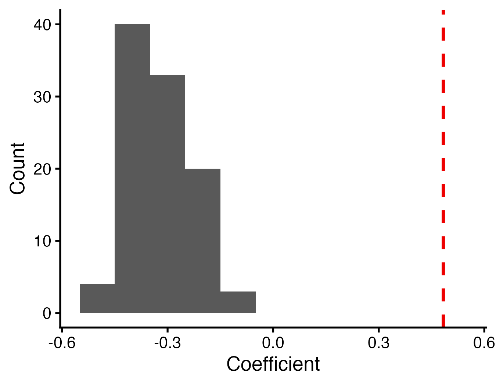
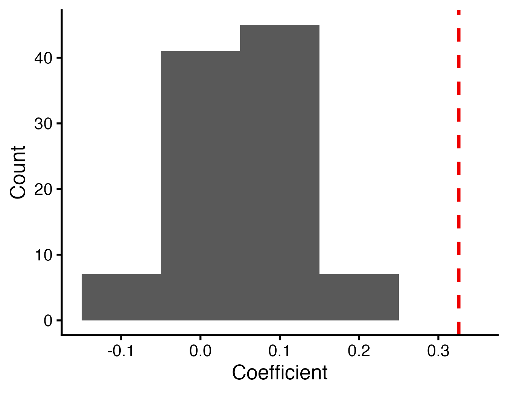
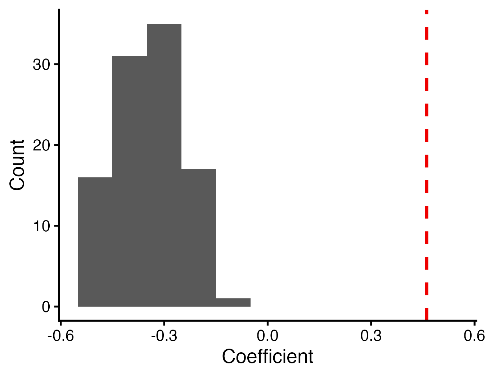
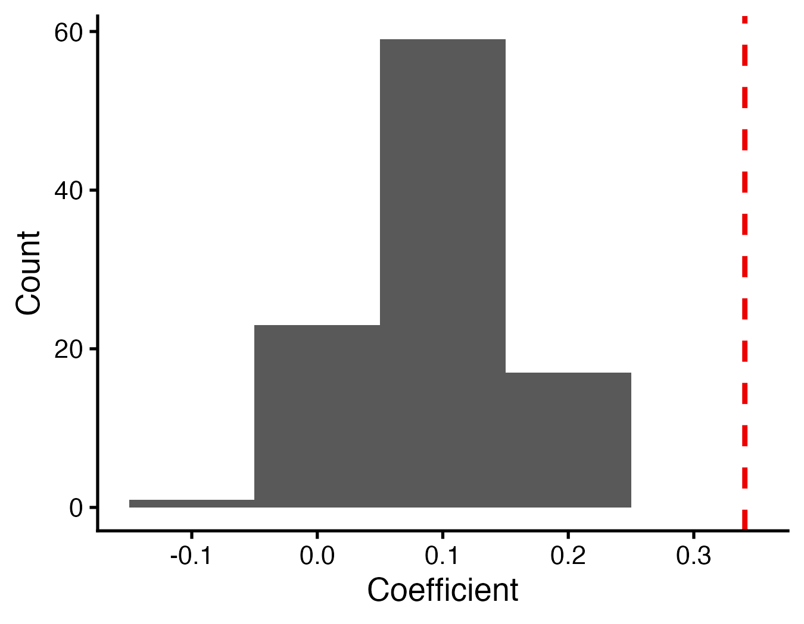

```{r Set_up, include=FALSE}

library(tidyverse)
library(broom)
library(broom.mixed)
library(knitr)
library(kableExtra)
library(flextable)
library(officer)


# Load models
mod_2i_par_agg_os_ps <- readRDS('Models/mod_2i_par_agg_os_ps.rds')
mod_2ii_par_agg_os_no_ps <- readRDS('Models/mod_2ii_par_agg_os_no_ps.rds')
mod_2iii_par_agg_os_active <- readRDS('Models/mod_2iii_par_agg_os_active.rds')
mod_2iv_par_agg_meg_ps <- readRDS('Models/mod_2iv_par_agg_meg_ps.rds')
mod_2v_par_agg_meg_no_ps <- readRDS('Models/mod_2v_par_agg_meg_no_ps.rds')
mod_2vi_par_agg_meg_active <- readRDS('Models/mod_2vi_par_agg_meg_active.rds')
mod_3bi_invest_filled_os <- readRDS('Models/mod_3bi_invest_filled_os.rds')
mod_3bii_invest_filled_meg <- readRDS('Models/mod_3bii_invest_filled_meg.rds')
mod_3ci_last_cell_os <- readRDS('Models/mod_3ci_last_cell_os.rds')
mod_3cii_last_cell_meg <- readRDS('Models/mod_3cii_last_cell_meg.rds')
mod_3di_inner_wall_os <- readRDS('Models/mod_3di_inner_wall_os.rds')
# mod_3dii_inner_wall_meg <- readRDS('Models/mod_3dii_inner_wall_meg.rds')


```

```{r Tidy_Tables, include=FALSE}

## Create functions 

# make a function that makes nice table with 2 decimal places, rounds them, makes the small numbers use exponents, and the p-value column to say < 0.0001 
tidy_function_glmer <- function(model) {
  tidy(model) %>%
    mutate(
      across(
        c(estimate, std.error, statistic),
        ~ case_when(
            is.na(.) ~ NA, # NA is NA 
            . == 0 ~ '0', # true zeros should be 0 not 0.00
            abs(.) < 0.01 ~ formatC(., format = 'e', digits = 2), # tiny numbers
            TRUE ~ sprintf('%.2f', .) # everything else should have 2 numbers after decimal
        )
      ),
      p.value = case_when(
        is.na(p.value) ~ NA, # NA is NA
        p.value < 0.0001 ~ '< 0.0001', # small p-values show as < 0.0001
        TRUE ~ sprintf('%.2f', p.value) # rest should have 2 numbers after decimal
      )
    )
}

# make function but for lmer
tidy_function_lmer <- function(model) {
  tidy(model) %>%
    mutate(
      across(
        c(estimate, std.error, df, statistic),
        ~ case_when(
            is.na(.) ~ NA, # NA is NA 
            . == 0 ~ '0', # true zeros should be 0 not 0.00
            abs(.) < 0.01 ~ formatC(., format = 'e', digits = 2), # tiny numbers
            TRUE ~ sprintf('%.2f', .) # everything else should have 2 numbers after decimal
        )
      ),
      p.value = case_when(
        is.na(p.value) ~ NA, # NA is NA
        p.value < 0.0001 ~ '< 0.0001', # small p-values show as < 0.0001
        TRUE ~ sprintf('%.2f', p.value) # rest should have 2 numbers after decimal
      )
    )
}

# make functon to replace sd__(Intercept) with the nested random effects, rename columns, rename ran_pars
format_table_function_glmer <- function(df) {
  df %>%
    mutate(term_2 = ifelse(term == 'sd__(Intercept)', group, term)) %>%
    select(-term, -group) %>%
    rename(
      Effect = effect,
      Variable = term_2,
      Estimate = estimate,
      'Std. Error' = std.error,
      'Z Value' = statistic,
      'P-Value' = p.value
    ) %>%
    relocate(last_col(), .after = 1) %>% 
  mutate(
    Effect = dplyr::recode(Effect,
                             'ran_pars' = 'random')
    ) %>% 
  mutate(
    Variable = dplyr::recode(Variable,
                             '(Intercept)' = 'Intercept',
                             'scale(Osmia_ps)' = 'Neighbouring Osmia',
                             'scale(Osmia_no_ps)' = 'Neighbouring Osmia excluding pseudo nests',
                             'scale(Meg_ps)' = 'Neighbouring Megachile',
                             'scale(Meg_no_ps)' = 'Neighbouring Megachile excluding pseudo nests',
                             'scale(Osmia_active_mothers)' = 'Neighbouring active Osmia mothers',
                             'scale(Meg_active_mothers)' = 'Neighbouring active Megachile mothers',
                             'scale(DP_os_prior)' = 'Neighbouring Osmia nests with detectable parasites',
                             'scale(NDP_os_prior)' = 'Neighbouring Osmia nests with no detectable parasites, excluding pseudo nests',
                             'scale(NDP_ps_os_prior)' = 'Neighbouring Osmia nests with no detectable parasites',
                             'scale(DP_os_prior):scale(NDP_ps_os_prior)' = 'Neighbouring Osmia nests with detectable parasites * Neighbouring Osmia nests with no detectable parasites', 
                              'scale(DP_meg_prior)' = 'Neighbouring Megachile nests with detectable parasites',
                             'scale(NDP_meg_prior)' = 'Neighbouring Megachile nests with no detectable parasites, excluding pseudo nests',
                             'scale(NDP_ps_meg_prior)' = 'Neighbouring Megachile nests with no detectable parasites',
                             'scale(DP_meg_prior):scale(NDP_ps_meg_prior)' = 'Neighbouring Megachile nests with detectable parasites * Neighbouring Megachile nests with no detectable parasites',
                             'Cell_parasitized' = 'Cell parasitism',
                             'Nest_parasitizedparasitized' = 'Nest parasitism (parasitized)',
                             'scale(DP_os_prior):Nest_parasitizedparasitized' = 'Neighbouring Osmia nests with detectable parasites * Nest parasitism (parasitized)',
                             'scale(DP_meg_prior):Nest_parasitizedparasitized' = 'Neighbouring Megachile nests with detectable parasites * Nest parasitism (parasitized)',
                             'poly(Day_of_year, 2)1' = 'Day of year I',
                             'poly(Day_of_year, 2)2' = 'Day of year II',
                             'Yearyear_2024' = 'Year (2024)',
                             'SiteCP' = 'Site (CP)', 
                             'SiteNN' = 'Site (NN)',
                             'Nest_ID:Trapnest:Subsite' = 'Nest ID: Nest-box: Subsite',
                             'Trapnest:Subsite' = 'Nest-box: Subsite'
                             )) 
} 

# same with lmer
# make functon to replace sd__(Intercept) with the nested random effects, rename columns, rename ran_pars
format_table_function_lmer <- function(df) {
  df %>%
    mutate(term_2 = ifelse(term == 'sd__(Intercept)', group, term)) %>%
    select(-term, -group) %>%
    rename(
      Effect = effect,
      Variable = term_2,
      Estimate = estimate,
      'Std. Error' = std.error,
      'T Value' = statistic,
      'DF' = df,
      'P-Value' = p.value
    ) %>%
    relocate(last_col(), .after = 1) %>% 
  mutate(
    Effect = dplyr::recode(Effect,
                             'ran_pars' = 'random')
    ) %>% 
  mutate(
    Variable = dplyr::recode(Variable,
                             '(Intercept)' = 'Intercept',
                             'scale(Osmia_ps)' = 'Neighbouring Osmia',
                             'scale(Osmia_no_ps)' = 'Neighbouring Osmia excluding pseudo nests',
                             'scale(Meg_ps)' = 'Neighbouring Megachile',
                             'scale(Meg_no_ps)' = 'Neighbouring Megachile excluding pseudo nests',
                             'scale(Osmia_active_mothers)' = 'Neighbouring active Osmia mothers',
                             'scale(Meg_active_mothers)' = 'Neighbouring active Megachile mothers',
                             'scale(DP_os_prior)' = 'Neighbouring Osmia nests with detectable parasites',
                             'scale(NDP_os_prior)' = 'Neighbouring Osmia nests with no detectable parasites, excluding pseudo nests',
                             'scale(NDP_ps_os_prior)' = 'Neighbouring Osmia nests with no detectable parasites',
                             'scale(DP_os_prior):scale(NDP_ps_os_prior)' = 'Neighbouring Osmia nests with detectable parasites * Neighbouring Osmia nests with no detectable parasites', 
                              'scale(DP_meg_prior)' = 'Neighbouring Megachile nests with detectable parasites',
                             'scale(NDP_meg_prior)' = 'Neighbouring Megachile nests with no detectable parasites, excluding pseudo nests',
                             'scale(NDP_ps_meg_prior)' = 'Neighbouring Megachile nests with no detectable parasites',
                             'scale(DP_meg_prior):scale(NDP_ps_meg_prior)' = 'Neighbouring Megachile nests with detectable parasites * Neighbouring Megachile nests with no detectable parasites',
                             'Cell_parasitized' = 'Cell parasitism',
                             'Nest_parasitizedparasitized' = 'Nest parasitism (parasitized)',
                             'scale(DP_os_prior):Nest_parasitizedparasitized' = 'Neighbouring Osmia nests with detectable parasites * Nest parasitism (parasitized)',
                             'scale(DP_meg_prior):Nest_parasitizedparasitized' = 'Neighbouring Megachile nests with detectable parasites * Nest parasitism (parasitized)',
                             'poly(Day_of_year, 2)1' = 'Day of year I',
                             'poly(Day_of_year, 2)2' = 'Day of year II',
                             'Yearyear_2024' = 'Year (2024)',
                             'SiteCP' = 'Site (CP)', 
                             'SiteNN' = 'Site (NN)',
                             'Nest_ID:Trapnest:Subsite' = 'Nest ID: Nest-box: Subsite',
                             'Trapnest:Subsite' = 'Nest-box: Subsite'
                             )) 
} 

## Apply functions

mod_2i_par_agg_os_ps_table <- tidy_function_glmer(mod_2i_par_agg_os_ps) %>% format_table_function_glmer() 
mod_2ii_par_agg_os_no_ps_table <- tidy_function_glmer(mod_2ii_par_agg_os_no_ps) %>% format_table_function_glmer() 
mod_2iii_par_agg_os_active_table <- tidy_function_glmer(mod_2iii_par_agg_os_active) %>% format_table_function_glmer() 
mod_2iv_par_agg_meg_ps_table <- tidy_function_glmer(mod_2iv_par_agg_meg_ps) %>% format_table_function_glmer()
mod_2v_par_agg_meg_no_ps_table <- tidy_function_glmer(mod_2v_par_agg_meg_no_ps) %>% format_table_function_glmer() 
mod_2vi_par_agg_meg_active_table <- tidy_function_glmer(mod_2vi_par_agg_meg_active) %>% format_table_function_glmer() 
mod_3bi_invest_filled_os_table <- tidy_function_lmer(mod_3bi_invest_filled_os) %>% format_table_function_lmer() # lmer
mod_3bii_invest_filled_meg_table <- tidy_function_lmer(mod_3bii_invest_filled_meg) %>% format_table_function_lmer() # lmer
mod_3ci_last_cell_os_table <- tidy_function_glmer(mod_3ci_last_cell_os) %>% format_table_function_glmer()
mod_3cii_last_cell_meg_table <- tidy_function_glmer(mod_3cii_last_cell_meg) %>% format_table_function_glmer()
mod_3di_inner_wall_os_table <- tidy_function_glmer(mod_3di_inner_wall_os) %>% format_table_function_glmer()
# mod_3dii_inner_wall_meg_table <- tidy_function_glmer(mod_3dii_inner_wall_meg) %>% format_table_function_glmer()


```

**Table S5.** Summary of the GLMM for prediction 1, model 1_i testing for an attraction to congenerics in nesting *Osmia*, including pseudo nests as congenerics.

```{r Model_1_i, echo=FALSE, message=FALSE}

# make df for table, best way to make it uniform with others
table_1i <- tribble(
  ~Effect,   ~Variable,
  "fixed",   "Neighbouring Osmia including pseudo nests",
  "fixed",   "Number of days with appropriate weather for bee activity",
  "fixed",   "Day of year I",
  "fixed",   "Day of year II",
  "fixed",   "Site",
  "random",  "Subsite: Trapnest"
)

# use functions
table_1i <- flextable(table_1i)
# remove all borders 
table_1i <- border_remove(table_1i)
# add only top and bottom horizontal lines 
table_1i <- hline_top(table_1i, part = "all",
                border = officer::fp_border(color = "black", width = 1))
table_1i <- hline_bottom(table_1i, part = "all",
                   border = officer::fp_border(color = "black", width = 1))
# set Times New Roman font 
table_1i <- font(table_1i, fontname = "Times New Roman", part = "all") %>%
  fontsize(size = 12, part = "all") %>% 
  bold(part = "header", bold = TRUE)
# make table take up full width of word doc
table_1i <- autofit(table_1i) 
table_1i <- set_table_properties(table_1i, width = 1, layout = "autofit")

table_1i




```

**Figure S2.** Histogram of coefficients from the 100 models using simulated data (grey bars) and the coefficient from the model using observed data (red line) for prediction 1, model 1_i.

**Table S6.** Summary of the GLMM for prediction 1, model 1_ii testing for an attraction to congenerics in nesting *Osmia*, excluding pseudo nests as congenerics.

```{r Model_1_ii, echo=FALSE, results='asis'}

# make df for table
table_1ii <- tribble(
  ~Effect,   ~Variable,
  "fixed",   "Neighbouring Osmia excluding pseudo nests",
  "fixed",   "Number of days with appropriate weather for bee activity",
  "fixed",   "Day of year I",
  "fixed",   "Day of year II",
  "fixed",   "Site",
  "random",  "Subsite: Trapnest"
)

# use functions
table_1ii <- flextable(table_1ii)
# remove all borders 
table_1ii <- border_remove(table_1ii)
# add only top and bottom horizontal lines 
table_1ii <- hline_top(table_1ii, part = "all",
                border = officer::fp_border(color = "black", width = 1))
table_1ii <- hline_bottom(table_1ii, part = "all",
                   border = officer::fp_border(color = "black", width = 1))
# set Times New Roman font 
table_1ii <- font(table_1ii, fontname = "Times New Roman", part = "all") %>%
  fontsize(size = 12, part = "all") %>% 
  bold(part = "header", bold = TRUE)
# make table take up full width of word doc
table_1ii <- autofit(table_1ii) 
table_1ii <- set_table_properties(table_1ii, width = 1, layout = "autofit")

table_1ii




```

**Figure S3.** Histogram of coefficients from the 100 models using simulated data (grey bars) and the coefficient from the model using observed data (red line) for prediction 1, model 1_ii.

**Table S7.** Summary of the GLMM for prediction 1, model 1_iii testing for an attraction to congenerics in nesting *Megachile*, including pseudo nests as congenerics.

```{r Model_1_iii, echo=FALSE}

# make df for table
table_1iii <- tribble(
  ~Effect,   ~Variable,
  "fixed",   "Neighbouring Megachile including pseudo nests",
  "fixed",   "Number of days with appropriate weather for bee activity",
  "fixed",   "Day of year I",
  "fixed",   "Day of year II",
  "fixed",   "Year",
  "fixed",   "Site",
  "random",  "Subsite: Trapnest"
)

# use functions
table_1iii <- flextable(table_1iii)
# remove all borders 
table_1iii <- border_remove(table_1iii)
# add only top and bottom horizontal lines 
table_1iii <- hline_top(table_1iii, part = "all",
                border = officer::fp_border(color = "black", width = 1))
table_1iii <- hline_bottom(table_1iii, part = "all",
                   border = officer::fp_border(color = "black", width = 1))
# set Times New Roman font 
table_1iii <- font(table_1iii, fontname = "Times New Roman", part = "all") %>%
  fontsize(size = 12, part = "all") %>% 
  bold(part = "header", bold = TRUE)
# make table take up full width of word doc
table_1iii <- autofit(table_1iii) 
table_1iii <- set_table_properties(table_1iii, width = 1, layout = "autofit")

table_1iii



```

**Figure S4.** Histogram of coefficients from the 100 models using simulated data (grey bars) and the coefficient from the model using observed data (red line) for prediction 1, model 1_iii.

**Table S8.** Summary of the GLMM for prediction 1, model 1_iv testing for an attraction to congenerics in nesting *Megachile*, excluding pseudo nests as congenerics.

```{r Model_1_iv, echo=FALSE}

# make df for table
table_1iv <- tribble(
  ~Effect,   ~Variable,
  "fixed",   "Neighbouring Megachile excluding pseudo nests",
  "fixed",   "Number of days with appropriate weather for bee activity",
  "fixed",   "Day of year I",
  "fixed",   "Day of year II",
  "fixed",   "Year",
  "fixed",   "Site",
  "random",  "Subsite: Trapnest"
)

# use functions
table_1iv <- flextable(table_1iv)
# remove all borders 
table_1iv <- border_remove(table_1iv)
# add only top and bottom horizontal lines 
table_1iv <- hline_top(table_1iv, part = "all",
                border = officer::fp_border(color = "black", width = 1))
table_1iv <- hline_bottom(table_1iv, part = "all",
                   border = officer::fp_border(color = "black", width = 1))
# set Times New Roman font 
table_1iv <- font(table_1iv, fontname = "Times New Roman", part = "all") %>%
  fontsize(size = 12, part = "all") %>% 
  bold(part = "header", bold = TRUE)
# make table take up full width of word doc
table_1iv <- autofit(table_1iv) 
table_1iv <- set_table_properties(table_1iv, width = 1, layout = "autofit")

table_1iv



```

**Figure S5.** Histogram of coefficients from the 100 models using simulated data (grey bars) and the coefficient from the model using observed data (red line) for prediction 1, model 1_iv.

**Table S9.** Summary of the GLMM output from model 2_i testing for an attraction to *Osmia* nests of brood parasites (*Sapyga*), including pseudo nests as *Osmia*.

```{r Model_2_i, echo=FALSE}

# create table
mod_2i_table <- flextable(mod_2i_par_agg_os_ps_table)
# remove all borders 
mod_2i_table <- border_remove(mod_2i_table)
# add only top and bottom horizontal lines 
mod_2i_table <- hline_top(mod_2i_table, part = "all",
                border = officer::fp_border(color = "black", width = 1))
mod_2i_table <- hline_bottom(mod_2i_table, part = "all",
                   border = officer::fp_border(color = "black", width = 1))
# set Times New Roman font 
mod_2i_table <- font(mod_2i_table, fontname = "Times New Roman", part = "all") %>%
  fontsize(size = 12, part = "all") %>% 
  bold(part = "header", bold = TRUE)
# set width
mod_2i_table <- mod_2i_table %>% width(j = c("Effect", "Variable", "Estimate", "Std. Error", "Z Value", "P-Value"), width = c(.7, 2.7, .8, .8, .8, .8))


mod_2i_table

```

**Table S10.** Summary of the GLMM output from model 2_ii for prediction 2, testing an attraction to *Osmia* nests of brood parasites (*Sapyga*), excluding pseudo nests as *Osmia*.

```{r Model_2_ii, echo=FALSE}
 
# create table
mod_2ii_table <- flextable(mod_2ii_par_agg_os_no_ps_table)
# remove all borders 
mod_2ii_table <- border_remove(mod_2ii_table)
# add only top and bottom horizontal lines 
mod_2ii_table <- hline_top(mod_2ii_table, part = "all",
                border = officer::fp_border(color = "black", width = 1))
mod_2ii_table <- hline_bottom(mod_2ii_table, part = "all",
                   border = officer::fp_border(color = "black", width = 1))
# set Times New Roman font 
mod_2ii_table <- font(mod_2ii_table, fontname = "Times New Roman", part = "all") %>%
  fontsize(size = 12, part = "all") %>% 
  bold(part = "header", bold = TRUE) 
# set width
mod_2ii_table <- mod_2ii_table %>% width(j = c("Effect", "Variable", "Estimate", "Std. Error", "Z Value", "P-Value"), width = c(.7, 2.7, .8, .8, .8, .8))

mod_2ii_table

```

**Table S11.** Summary of the GLMM output from model 2_iii for prediction 2, testing an attraction to active *Osmia* nests of brood parasites (*Sapyga*), excluding pseudo nests as *Osmia*.

```{r Model_2_iii, echo=FALSE}
 
# create table
mod_2iii_table <- flextable(mod_2iii_par_agg_os_active_table)
# remove all borders 
mod_2iii_table <- border_remove(mod_2iii_table)
# add only top and bottom horizontal lines 
mod_2iii_table <- hline_top(mod_2iii_table, part = "all",
                border = officer::fp_border(color = "black", width = 1))
mod_2iii_table <- hline_bottom(mod_2iii_table, part = "all",
                   border = officer::fp_border(color = "black", width = 1))
# set Times New Roman font 
mod_2iii_table <- font(mod_2iii_table, fontname = "Times New Roman", part = "all") %>%
  fontsize(size = 12, part = "all") %>% 
  bold(part = "header", bold = TRUE)
# set width
mod_2iii_table <- mod_2iii_table %>% width(j = c("Effect", "Variable", "Estimate", "Std. Error", "Z Value", "P-Value"), width = c(.7, 2.7, .8, .8, .8, .8)) 

mod_2iii_table

```

**Table S12.** Summary of the GLMM output from model 2_iv for prediction 2, testing an attraction to *Megachile* in brood parasites (*Meloid, Chalcid*, and *Coelioxys*), including pseudo nests as *Megachile*.

```{r Model_2_iv, echo=FALSE}

# create table
mod_2iv_table <- flextable(mod_2iv_par_agg_meg_ps_table)
# remove all borders 
mod_2iv_table <- border_remove(mod_2iv_table)
# add only top and bottom horizontal lines 
mod_2iv_table <- hline_top(mod_2iv_table, part = "all",
                border = officer::fp_border(color = "black", width = 1))
mod_2iv_table <- hline_bottom(mod_2iv_table, part = "all",
                   border = officer::fp_border(color = "black", width = 1))
# set Times New Roman font 
mod_2iv_table <- font(mod_2iv_table, fontname = "Times New Roman", part = "all") %>%
  fontsize(size = 12, part = "all") %>% 
  bold(part = "header", bold = TRUE)
# width
mod_2iv_table <- mod_2iv_table %>% width(j = c("Effect", "Variable", "Estimate", "Std. Error", "Z Value", "P-Value"), width = c(.7, 2.7, .8, .8, .8, .8))

mod_2iv_table


```

**Table S13.** Summary of the GLMM output from model 2_v for prediction 2, testing an attraction to *Megachile* in brood parasites (*Meloid, Chalcid*, and *Coelioxys*), excluding pseudo nests as *Megachile*.

```{r Model_2_v, echo=FALSE}

# create table
mod_2v_table <- flextable(mod_2v_par_agg_meg_no_ps_table)
# remove all borders 
mod_2v_table <- border_remove(mod_2v_table)
# add only top and bottom horizontal lines 
mod_2v_table <- hline_top(mod_2v_table, part = "all",
                border = officer::fp_border(color = "black", width = 1))
mod_2v_table <- hline_bottom(mod_2v_table, part = "all",
                   border = officer::fp_border(color = "black", width = 1))
# set Times New Roman font 
mod_2v_table <- font(mod_2v_table, fontname = "Times New Roman", part = "all") %>%
  fontsize(size = 12, part = "all") %>% 
  bold(part = "header", bold = TRUE) 
# make table take up full width of word doc
mod_2v_table <- mod_2v_table %>% width(j = c("Effect", "Variable", "Estimate", "Std. Error", "Z Value", "P-Value"), width = c(.7, 2.7, .8, .8, .8, .8))

mod_2v_table

```

**Table S14.** Summary of the GLMM output from model 2_vi for prediction 2, testing an attraction to active *Megachile* nests of brood parasites (*Meloid, Chalcid*, and *Coelioxys*), excluding pseudo nests as *Megachile*.

```{r Model_2_vi, echo=FALSE}

# create table
mod_2vi_table <- flextable(mod_2vi_par_agg_meg_active_table)
# remove all borders 
mod_2vi_table <- border_remove(mod_2vi_table)
# add only top and bottom horizontal lines 
mod_2vi_table <- hline_top(mod_2vi_table, part = "all",
                border = officer::fp_border(color = "black", width = 1))
mod_2vi_table <- hline_bottom(mod_2vi_table, part = "all",
                   border = officer::fp_border(color = "black", width = 1))
# set Times New Roman font 
mod_2vi_table <- font(mod_2vi_table, fontname = "Times New Roman", part = "all") %>%
  fontsize(size = 12, part = "all") %>% 
  bold(part = "header", bold = TRUE)
# make table take up full width of word doc
mod_2vi_table <- mod_2vi_table %>% width(j = c("Effect", "Variable", "Estimate", "Std. Error", "Z Value", "P-Value"), width = c(.7, 2.7, .8, .8, .8, .8))

mod_2vi_table

```

**Table S15.** Summary of the GLMM output from model 3a_i for prediction 3a, testing an avoidance of parasites and an attraction to congenerics in nesting *Osmia*, including pseudo nests as congeneric nests with no detectable parasites.

```{r Model_3a_i, echo=FALSE}

# make df for table
table_3ai <- tribble(
  ~Effect,   ~Variable,
  "fixed",   "Neighbouring Osmia nests with detectable parasites",
  "fixed",   "Neighbouring Osmia nests with no detectable parasites, including pseudo nests",
  "fixed",   "Number of days with appropriate weather for bee activity",
  "fixed",   "Day of year I",
  "fixed",   "Day of year II",
  "fixed",   "Site",
  "random",  "Subsite: Trapnest"
)

# use functions
table_3ai <- flextable(table_3ai)
# remove all borders 
table_3ai <- border_remove(table_3ai)
# add only top and bottom horizontal lines 
table_3ai <- hline_top(table_3ai, part = "all",
                border = officer::fp_border(color = "black", width = 1))
table_3ai <- hline_bottom(table_3ai, part = "all",
                   border = officer::fp_border(color = "black", width = 1))
# set Times New Roman font 
table_3ai <- font(table_3ai, fontname = "Times New Roman", part = "all") %>%
  fontsize(size = 12, part = "all") %>% 
  bold(part = "header", bold = TRUE)
# make table take up full width of word doc
table_3ai <- autofit(table_3ai) 
table_3ai <- set_table_properties(table_3ai, width = 1, layout = "autofit") 

table_3ai


include_graphics("Figures/hist_3ai.png")

```

**Figure S6.** Histogram of coefficients from the 100 models using simulated data (grey bars) and the coefficient from the model using observed data (red line) for prediction 3, model 3_i.

**Table S16.** Summary of the GLMM output from model 3a_ii for prediction 3a, testing an avoidance of parasites and an attraction to congenerics in nesting *Osmia*, excluding pseudo nests as congeneric nests with no detectable parasites.

```{r Model_3a_ii, echo=FALSE}

# make df for table
table_3aii <- tribble(
  ~Effect,   ~Variable,
  "fixed",   "Neighbouring Osmia nests with detectable parasites",
  "fixed",   "Neighbouring Osmia nests with no detectable parasites, excluding pseudo nests",
  "fixed",   "Number of days with appropriate weather for bee activity",
  "fixed",   "Day of year I",
  "fixed",   "Day of year II",
  "fixed",   "Site",
  "random",  "Subsite: Trapnest"
)

# use functions
table_3aii <- flextable(table_3aii)
# remove all borders 
table_3aii <- border_remove(table_3aii)
# add only top and bottom horizontal lines 
table_3aii <- hline_top(table_3aii, part = "all",
                border = officer::fp_border(color = "black", width = 1))
table_3aii <- hline_bottom(table_3aii, part = "all",
                   border = officer::fp_border(color = "black", width = 1))
# set Times New Roman font 
table_3aii <- font(table_3aii, fontname = "Times New Roman", part = "all") %>%
  fontsize(size = 12, part = "all") %>% 
  bold(part = "header", bold = TRUE)
# make table take up full width of word doc
table_3aii <- autofit(table_3aii) 
table_3aii <- set_table_properties(table_3aii, width = 1, layout = "autofit")

table_3aii

include_graphics("Figures/hist_3aii.png")

```

**Figure S6.** Histogram of coefficients from the 100 models using simulated data (grey bars) and the coefficient from the model using observed data (red line) for prediction 3, model 3_ii.

**Table S17.** Summary of the GLMM output from model 3a_iii for prediction 3a, testing an avoidance of parasites and an attraction to congenerics in nesting *Megachile*, including pseudo nests as congeneric nests with no detectable parasites. Due to the small sample size, we could not execute the model excluding pseudo nests, thus there is no table for output from model 3a_iv.

```{r Model_3a_iii, echo=FALSE}

# make df for table
table_3aiii <- tribble(
  ~Effect,   ~Variable,
  "fixed",   "Neighbouring Megachile nests with detectable parasites",
  "fixed",   "Neighbouring Megachile nests with no detectable parasites, including pseudo nests",
  "fixed",   "Number of days with appropriate weather for bee activity",
  "fixed",   "Day of year I",
  "fixed",   "Day of year II",
  "fixed",   "Site",
  "random",  "Subsite: Trapnest"
)

# use functions
table_3aiii <- flextable(table_3aiii)
# remove all borders 
table_3aiii <- border_remove(table_3aiii)
# add only top and bottom horizontal lines 
table_3aiii <- hline_top(table_3aiii, part = "all",
                border = officer::fp_border(color = "black", width = 1))
table_3aiii <- hline_bottom(table_3aiii, part = "all",
                   border = officer::fp_border(color = "black", width = 1))
# set Times New Roman font 
table_3aiii <- font(table_3aiii, fontname = "Times New Roman", part = "all") %>%
  fontsize(size = 12, part = "all") %>% 
  bold(part = "header", bold = TRUE)
# make table take up full width of word doc
table_3aiii <- autofit(table_3aiii) 
table_3aiii <- set_table_properties(table_3aiii, width = 1, layout = "autofit")

table_3aiii

include_graphics("Figures/hist_3aiii.png")

```

**Figure S6.** Histogram of coefficients from the 100 models using simulated data (grey bars) and the coefficient from the model using observed data (red line) for prediction 3, model 3_iii.

**Table S18.** Summary of the GLMM output from model 3b_i for prediction 3b, testing a change in nest investment of *Osmia* in response to brood parasites.

```{r Model_3b_i, echo=FALSE}

# create table
mod_3bi_table <- flextable(mod_3bi_invest_filled_os_table)
# remove all borders 
mod_3bi_table <- border_remove(mod_3bi_table)
# add only top and bottom horizontal lines 
mod_3bi_table <- hline_top(mod_3bi_table, part = "all",
                border = officer::fp_border(color = "black", width = 1))
mod_3bi_table <- hline_bottom(mod_3bi_table, part = "all",
                   border = officer::fp_border(color = "black", width = 1))
# set Times New Roman font 
mod_3bi_table <- font(mod_3bi_table, fontname = "Times New Roman", part = "all") %>%
  fontsize(size = 12, part = "all") %>% 
  bold(part = "header", bold = TRUE)
# make table take up full width of word doc
mod_3bi_table <- mod_3bi_table %>% width(j = c("Effect", "Variable", "Estimate", "Std. Error", "DF", "T Value", "P-Value"), width = c(.7, 2.4, .8, .7, .7, .7, .7))

mod_3bi_table 

```

**Table S19.** Summary of the GLMM output from model 3b_ii for prediction 3b, testing a change in nest investment of *Megachile* in response to brood parasites.

```{r Model_3b_ii, echo=FALSE}

# create table
mod_3bii_table <- flextable(mod_3bii_invest_filled_meg_table)
# remove all borders 
mod_3bii_table <- border_remove(mod_3bii_table)
# add only top and bottom horizontal lines 
mod_3bii_table <- hline_top(mod_3bii_table, part = "all",
                border = officer::fp_border(color = "black", width = 1))
mod_3bii_table <- hline_bottom(mod_3bii_table, part = "all",
                   border = officer::fp_border(color = "black", width = 1))
# set Times New Roman font 
mod_3bii_table <- font(mod_3bii_table, fontname = "Times New Roman", part = "all") %>%
  fontsize(size = 12, part = "all") %>% 
  bold(part = "header", bold = TRUE)
# make table take up full width of word doc
mod_3bii_table <- mod_3bii_table %>% width(j = c("Effect", "Variable", "Estimate", "Std. Error", "DF", "T Value", "P-Value"), width = c(.7, 2.4, .8, .7, .7, .7, .7))

mod_3bii_table

```

**Table S20.** Summary of the GLMM output from model 3c_i for prediction 3c, testing if brood cell parasitization predicts nest termination in *Osmia*.

```{r Model_3c_i, echo=FALSE}

# create table
mod_3ci_table <- flextable(mod_3ci_last_cell_os_table)
# remove all borders 
mod_3ci_table <- border_remove(mod_3ci_table)
# add only top and bottom horizontal lines 
mod_3ci_table <- hline_top(mod_3ci_table, part = "all",
                border = officer::fp_border(color = "black", width = 1))
mod_3ci_table <- hline_bottom(mod_3ci_table, part = "all",
                   border = officer::fp_border(color = "black", width = 1))
# set Times New Roman font 
mod_3ci_table <- font(mod_3ci_table, fontname = "Times New Roman", part = "all") %>%
  fontsize(size = 12, part = "all") %>% 
  bold(part = "header", bold = TRUE)
# make table take up full width of word doc
mod_3ci_table <- mod_3ci_table %>% width(j = c("Effect", "Variable", "Estimate", "Std. Error", "Z Value", "P-Value"), width = c(.7, 2.7, .8, .8, .8, .8))

mod_3ci_table

```

**Table S21.** Summary of the GLMM output from model 3c_ii for prediction 3c, testing if brood cell parasitization predicts nest termination in *Megachile*.

```{r Model_3c_ii, echo=FALSE}

# create table
mod_3cii_table <- flextable(mod_3cii_last_cell_meg_table)
# remove all borders 
mod_3cii_table <- border_remove(mod_3cii_table)
# add only top and bottom horizontal lines 
mod_3cii_table <- hline_top(mod_3cii_table, part = "all",
                border = officer::fp_border(color = "black", width = 1))
mod_3cii_table <- hline_bottom(mod_3cii_table, part = "all",
                   border = officer::fp_border(color = "black", width = 1))
# set Times New Roman font 
mod_3cii_table <- font(mod_3cii_table, fontname = "Times New Roman", part = "all") %>%
  fontsize(size = 12, part = "all") %>% 
  bold(part = "header", bold = TRUE)
# make table take up full width of word doc
mod_3cii_table <- mod_3cii_table %>% width(j = c("Effect", "Variable", "Estimate", "Std. Error", "Z Value", "P-Value"), width = c(.7, 2.7, .8, .8, .8, .8))

mod_3cii_table

```

**Table S22.** Summary of the GLMM output from model 3d_i for prediction 3d, testing abandoning inner walls as a response to brood parasites in *Osmia*.

```{r Model_3d_i, echo=FALSE}

# create table
mod_3di_table <- flextable(mod_3di_inner_wall_os_table)
# remove all borders 
mod_3di_table <- border_remove(mod_3di_table)
# add only top and bottom horizontal lines 
mod_3di_table <- hline_top(mod_3di_table, part = "all",
                border = officer::fp_border(color = "black", width = 1))
mod_3di_table <- hline_bottom(mod_3di_table, part = "all",
                   border = officer::fp_border(color = "black", width = 1))
# set Times New Roman font  
mod_3di_table <- font(mod_3di_table, fontname = "Times New Roman", part = "all") %>%
  fontsize(size = 12, part = "all") %>% 
  bold(part = "header", bold = TRUE)
# make table take up full width of word doc
mod_3di_table <- mod_3di_table %>% width(j = c("Effect", "Variable", "Estimate", "Std. Error", "Z Value", "P-Value"), width = c(.7, 2.7, .8, .8, .8, .8))

mod_3di_table

```

```{r Model_3d_ii, echo=FALSE}

# Table S23. Summary of the GLMM output from model 3d_i for prediction 3d, testing abandoning inner walls in response to brood parasites in Megachile.

# # create table
# mod_3dii_table <- flextable(mod_3dii_inner_wall_meg_table)
# # remove all borders 
# mod_3dii_table <- border_remove(mod_3dii_table)
# # add only top and bottom horizontal lines 
# mod_3dii_table <- hline_top(mod_3dii_table, part = "all",
#                 border = officer::fp_border(color = "black", width = 1))
# mod_3dii_table <- hline_bottom(mod_3dii_table, part = "all",
#                    border = officer::fp_border(color = "black", width = 1))
# # set Times New Roman font 
# mod_3dii_table <- font(mod_3dii_table, fontname = "Times New Roman", part = "all") %>%
#   fontsize(size = 12, part = "all") %>% 
#   bold(part = "header", bold = TRUE)
# # make table take up full width of word doc
# mod_3dii_table <- mod_3dii_table %>% width(j = c("Effect", "Variable", "Estimate", "Std. Error", "Z Value", "P-Value"), width = c(.7, 2.7, .8, .8, .8, .8))
# 
# mod_3dii_table

```
