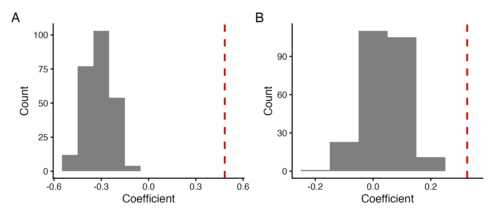
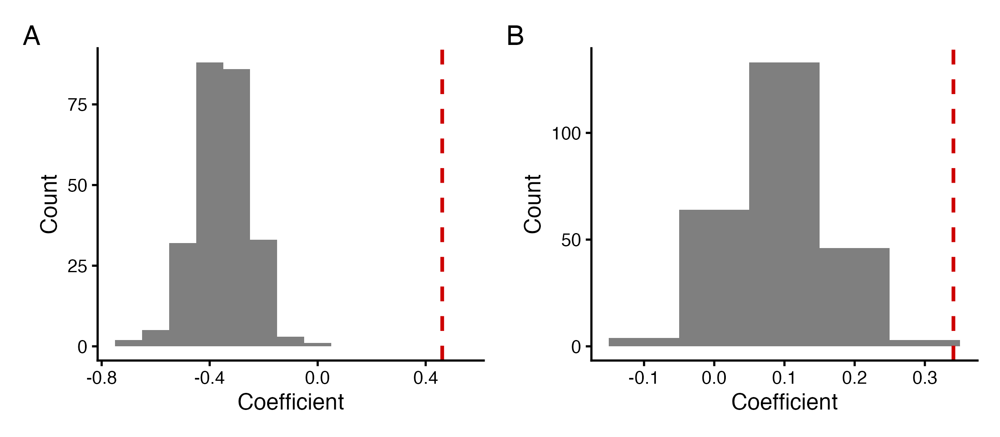
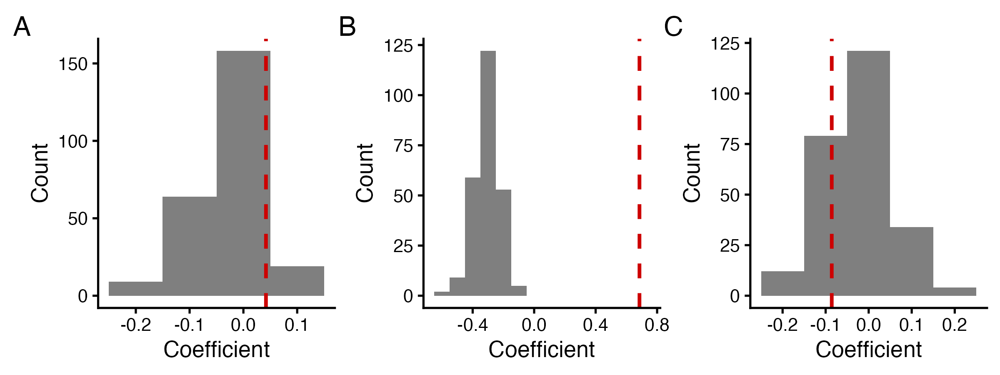
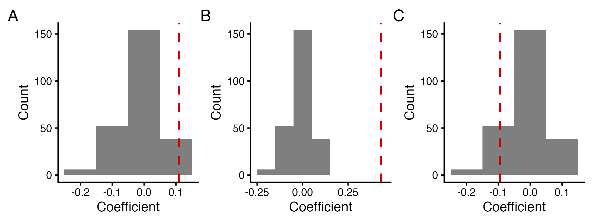
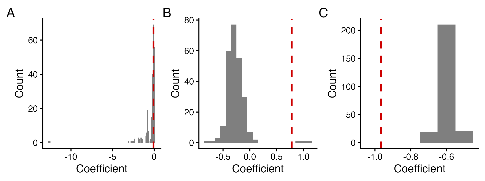

```{r Set_up, include=FALSE}

library(tidyverse)
library(broom)
library(broom.mixed)
library(flextable)
library(knitr)
library(kableExtra)
library(officer) # for boarders


# Load models
mod_1i_choice_consp_os_ps <- readRDS('Models/mod_1i_choice_consp_os_ps.rds')
mod_1ii_choice_consp_os_no_ps <- readRDS('Models/mod_1ii_choice_consp_os_no_ps.rds')
mod_1iii_choice_consp_meg_ps <- readRDS('Models/mod_1iii_choice_consp_meg_ps.rds')
mod_1iv_choice_consp_meg_no_ps <- readRDS('Models/mod_1iv_choice_consp_meg_no_ps.rds')
mod_2i_par_agg_os_ps <- readRDS('Models/mod_2i_par_agg_os_ps.rds')
mod_2ii_par_agg_os_no_ps <- readRDS('Models/mod_2ii_par_agg_os_no_ps.rds')
mod_2iii_par_agg_os_active <- readRDS('Models/mod_2iii_par_agg_os_active.rds')
mod_2iv_par_agg_meg_ps <- readRDS('Models/mod_2iv_par_agg_meg_ps.rds')
mod_2v_par_agg_meg_no_ps <- readRDS('Models/mod_2v_par_agg_meg_no_ps.rds')
mod_2vi_par_agg_meg_active <- readRDS('Models/mod_2vi_par_agg_meg_active.rds')
mod_3ai_choice_consp_par_os_ps <- readRDS('Models/mod_3ai_choice_consp_par_os_ps.rds')
mod_3aii_choice_consp_par_os_no_ps <- readRDS('Models/mod_3aii_choice_consp_par_os_no_ps.rds')
mod_3aiii_choice_consp_par_meg_ps <- readRDS('Models/mod_3aiii_choice_consp_par_meg_ps.rds')
mod_3aiv_choice_consp_par_meg_no_ps <- readRDS('Models/mod_3aiv_choice_consp_par_meg_no_ps.rds')
mod_3bi_invest_filled_os <- readRDS('Models/mod_3bi_invest_filled_os.rds')
mod_3bii_invest_filled_meg <- readRDS('Models/mod_3bii_invest_filled_meg.rds')
mod_3ci_last_cell_os <- readRDS('Models/mod_3ci_last_cell_os.rds')
mod_3cii_last_cell_meg <- readRDS('Models/mod_3cii_last_cell_meg.rds')
mod_3di_inner_wall_os <- readRDS('Models/mod_3di_inner_wall_os.rds')
# mod_3dii_inner_wall_meg <- readRDS('Models/mod_3dii_inner_wall_meg.rds')

# for extra figures
nesting_cells_os <- read_csv('data/nesting_cells_cleaned_osmia.csv')
nesting_cells_os <- nesting_cells_os %>% filter(Year != 'year_2024')
nesting_cells_os <- nesting_cells_os %>% filter(Site != 'CP')
trapnesting_meg <- read_csv('data/trapnesting_cleaned_megachile.csv')
trapnesting_meg <- trapnesting_meg %>% filter(Site != 'NN')


```

```{r Tidy_Tables, include=FALSE}

## Create functions 

# make a function that makes nice table with 2 decimal places, rounds them, makes the small numbers use exponents, and the p-value column to say < 0.0001 
tidy_function_glmer <- function(model) {
  tidy(model) %>%
    mutate(
      across(
        c(estimate, std.error, statistic),
        ~ case_when(
            is.na(.) ~ NA, # NA is NA 
            . == 0 ~ '0', # true zeros should be 0 not 0.00
            abs(.) < 0.01 ~ formatC(., format = 'e', digits = 2), # tiny numbers
            TRUE ~ sprintf('%.2f', .) # everything else should have 2 numbers after decimal
        )
      ),
      # keep numeric p-value for comparisons
      p.value.num = p.value,
      # create formatted p-value text
      p.value = case_when(
        is.na(p.value.num) ~ ' ',
        p.value.num < 0.0001 ~ '< 0.0001',
        p.value.num < 0.001  ~ '< 0.001',
        p.value.num < 0.01   ~ '< 0.01',
        TRUE ~ sprintf('%.2f', p.value.num)
      ),
      # now add stars based on numeric p-value
      p.value = paste0(
        p.value,
        case_when(
          is.na(p.value.num) ~ ' ',
          p.value.num < 0.0001 ~ ' ***',
          p.value.num < 0.001  ~ ' **',
          p.value.num < 0.05   ~ ' *',
          TRUE ~ ''
        )
      )
    ) %>%
    select(-p.value.num) # remove temporary numeric column
}


tidy_function_lmer <- function(model) {
  tidy(model) %>%
    mutate(
      across(
        c(estimate, std.error, df, statistic),
        ~ case_when(
          is.na(.) ~ NA, # NA is NA 
          . == 0 ~ '0', # true zeros should be 0 not 0.00
          abs(.) < 0.01 ~ formatC(., format = 'e', digits = 2), # tiny numbers
          TRUE ~ sprintf('%.2f', .) # everything else 2 decimals
        )
      ),
      # keep numeric p-value for comparisons
      p.value.num = p.value,
      # create formatted p-value text
      p.value = case_when(
        is.na(p.value.num) ~ ' ',
        p.value.num < 0.0001 ~ '< 0.0001',
        p.value.num < 0.001  ~ '< 0.001',
        p.value.num < 0.01   ~ '< 0.01',
        TRUE ~ sprintf('%.2f', p.value.num)
      ),
      # now add stars based on p-value
      p.value = paste0(
        p.value,
        case_when(
          is.na(p.value.num) ~ ' ',
          p.value.num < 0.0001 ~ ' ***',
          p.value.num < 0.001  ~ ' **',
          p.value.num < 0.05   ~ ' *',
          TRUE ~ ''
        )
      )
    ) %>%
    select(-p.value.num) # remove temporary numeric column
}


# make table format funciton for all tables for glmer, make functon to replace sd__(Intercept) with the nested random effects, rename columns, rename ran_pars
format_table_function_glmer <- function(df) {
  df %>%
    mutate(term_2 = ifelse(term == 'sd__(Intercept)', group, term)) %>%
    select(-term, -group) %>%
    rename(
      Effect = effect,
      Variable = term_2,
      Estimate = estimate,
      'Std. Error' = std.error,
      'Z Value' = statistic,
      'P-Value' = p.value
    ) %>%
    relocate(last_col(), .after = 1) %>% 
  mutate(
    Effect = dplyr::recode(Effect,
                             'ran_pars' = 'random')
    )
}


# same with lmer
format_table_function_lmer <- function(df) {
  df %>%
    mutate(term_2 = ifelse(term == 'sd__(Intercept)', group, term)) %>%
    select(-term, -group) %>%
    rename(
      Effect = effect,
      Variable = term_2,
      Estimate = estimate,
      'Std. Error' = std.error,
      'T Value' = statistic,
      'DF' = df,
      'P-Value' = p.value
    ) %>%
    relocate(last_col(), .after = 1) %>% 
  mutate(
    Effect = dplyr::recode(Effect,
                             'ran_pars' = 'random')
    )
}


# make function for renaming variables for glmer
format_table_function_terms <- function(df) {
  df %>%
    mutate(
      Variable = dplyr::recode(Variable,
                               '(Intercept)' = 'Intercept',
                               'scale(Osmia_ps_prior)' = 'Neighbouring congeneric nests, including pseudo nests',
                               'scale(Osmia_no_ps_prior)' = 'Neighbouring congeneric nests, excluding pseudo nests',
                               'scale(Meg_ps_prior)' = 'Neighbouring congeneric nests, including pseudo nests',
                               'scale(Meg_no_ps_prior)' = 'Neighbouring congeneric nests excluding pseudo nests',
                               'scale(Good_days)' = 'Days with appropriate weather for bee activity',
                               'scale(DP_os_prior)' = 'Neighbouring congeneric nests with detectable parasites',
                               'scale(NDP_os_prior)' = 'Neighbouring congeneric nests with no detectable parasites, excluding pseudo nests',
                               'scale(NDP_ps_os_prior)' = 'Neighbouring congeneric nests with no detectable parasites',
                               'scale(DP_os_prior):scale(NDP_ps_os_prior)' = 'Neighbouring congeneric nests with detectable parasites * Neighbouring congeneric nests with no detectable parasites, including pseudo nests',
                               'scale(DP_os_prior):scale(NDP_os_prior)' = 'Neighbouring congeneric nests with detectable parasites * Neighbouring congeneric nests with no detectable parasites, excluding speudo nests',
                               'scale(DP_meg_prior)' = 'Neighbouring congeneric nests with detectable parasites',
                               'scale(NDP_meg_prior)' = 'Neighbouring congeneric nests with no detectable parasites, excluding pseudo nests',
                               'scale(NDP_ps_meg_prior)' = 'Neighbouring congeneric nests with no detectable parasites',
                               'scale(DP_meg_prior):scale(NDP_ps_meg_prior)' = 'Neighbouring congeneric nests with detectable parasites * Neighbouring congeneric nests with no detectable parasites, including pseudo nests',
                               'scale(DP_meg_prior):scale(NDP_meg_prior)' = 'Neighbouring congeneric nests with detectable parasites * Neighbouring congeneric nests with no detectable parasites, excluding pseudo nests',
                               'Cell_parasitized' = 'Cell parasitism',
                               'Nest_parasitizedparasitized' = 'Nest parasitism (parasitized)',
                               'scale(DP_os_prior):Nest_parasitizedparasitized' = 'Neighbouring Osmia nests with detectable parasites * Nest parasitism (parasitized)',
                               'scale(DP_meg_prior):Nest_parasitizedparasitized' = 'Neighbouring congeneric nests with detectable parasites * Nest parasitism (parasitized)',
                               'poly(Day_of_year, 2)1' = 'Day of year I',
                               'poly(Day_of_year, 2)2' = 'Day of year II',
                               'Yearyear_2024' = 'Year (2024)',
                               'SiteCP' = 'Site (CP)',
                               'SiteNN' = 'Site (NN)',
                               'Nest_ID:Trapnest:Subsite' = 'Nest ID: Nest-box: Subsite',
                               'Trapnest:Subsite' = 'Nest-box: Subsite'
   )
 )
} 

# make different labels for parasite one
format_table_function_terms_par <- function(df) {
  df %>%
    mutate(
      Variable = dplyr::recode(Variable,
                               '(Intercept)' = 'Intercept',
                               'scale(Osmia_ps)' = 'Number of host nests, including pseudo nests',
                               'scale(Osmia_no_ps)' = 'Number of host nests, excluding pseudo nests',
                               'scale(Meg_ps)' = 'Number of host nests, including pseudo nests',
                               'scale(Meg_no_ps)' = 'Number of host nests, excluding pseudo nests',
                               'scale(Osmia_active_mothers)' = 'Active host mothers',
                               'scale(Meg_active_mothers)' = 'Active host mothers',
                               'Cell_parasitized' = 'Cell parasitism',
                               'Nest_parasitizedparasitized' = 'Focal nest parasitism (parasitized)',
                               'scale(DP_os_prior):Nest_parasitizedparasitized' = 'Number of host nests with detectable parasites * Focal nest parasitism (parasitized)',
                               'scale(DP_meg_prior):Nest_parasitizedparasitized' = 'Neighbouring host nests with detectable parasites * Focal nest parasitism (parasitized)',
                               'poly(Day_of_year, 2)1' = 'Day of year I',
                               'poly(Day_of_year, 2)2' = 'Day of year II',
                               'Yearyear_2024' = 'Year (2024)',
                               'SiteCP' = 'Site (CP)',
                               'SiteNN' = 'Site (NN)',
                               'Nest_ID:Trapnest:Subsite' = 'Nest ID: Nest-box: Subsite',
                               'Trapnest:Subsite' = 'Nest-box: Subsite'
   )
 )
} 


## Apply functions


# P1 - glmer
mod_1i_choice_consp_os_ps_table <- tidy_function_glmer(mod_1i_choice_consp_os_ps) %>%
  format_table_function_glmer %>% 
  format_table_function_terms()
mod_1ii_choice_consp_os_no_ps_table <- tidy_function_glmer(mod_1ii_choice_consp_os_no_ps) %>%
  format_table_function_glmer %>% 
  format_table_function_terms()
mod_1iii_choice_consp_meg_ps_table <- tidy_function_glmer(mod_1iii_choice_consp_meg_ps) %>%
  format_table_function_glmer %>% 
  format_table_function_terms()
mod_1iv_choice_consp_meg_no_ps_table <- tidy_function_glmer(mod_1iv_choice_consp_meg_no_ps) %>%
  format_table_function_glmer %>% 
  format_table_function_terms()

# P2 - glmer and parasites
mod_2i_par_agg_os_ps_table <- tidy_function_glmer(mod_2i_par_agg_os_ps) %>%
  format_table_function_glmer %>% 
  format_table_function_terms_par() 
mod_2ii_par_agg_os_no_ps_table <- tidy_function_glmer(mod_2ii_par_agg_os_no_ps) %>%
  format_table_function_glmer %>% 
  format_table_function_terms_par()
mod_2iii_par_agg_os_active_table <- tidy_function_glmer(mod_2iii_par_agg_os_active) %>%
  format_table_function_glmer %>% 
  format_table_function_terms_par() 
mod_2iv_par_agg_meg_ps_table <- tidy_function_glmer(mod_2iv_par_agg_meg_ps) %>%
  format_table_function_glmer %>% 
  format_table_function_terms_par()
mod_2v_par_agg_meg_no_ps_table <- tidy_function_glmer(mod_2v_par_agg_meg_no_ps) %>%
  format_table_function_glmer %>% 
  format_table_function_terms_par()
mod_2vi_par_agg_meg_active_table <- tidy_function_glmer(mod_2vi_par_agg_meg_active) %>%
  format_table_function_glmer %>% 
  format_table_function_terms_par()

# P3 - glmer
mod_3ai_choice_consp_par_os_ps_table <- tidy_function_glmer(mod_3ai_choice_consp_par_os_ps) %>%
  format_table_function_glmer %>% 
  format_table_function_terms()
mod_3aii_choice_consp_par_os_no_ps_table <- tidy_function_glmer(mod_3aii_choice_consp_par_os_no_ps) %>%
  format_table_function_glmer %>% 
  format_table_function_terms()
mod_3aiii_choice_consp_par_meg_ps_table <- tidy_function_glmer(mod_3aiii_choice_consp_par_meg_ps) %>%
  format_table_function_glmer %>% 
  format_table_function_terms()
mod_3aiv_choice_consp_par_meg_no_ps_table <- tidy_function_glmer(mod_3aiv_choice_consp_par_meg_no_ps) %>%
  format_table_function_glmer %>% 
  format_table_function_terms()
mod_3ci_last_cell_os_table <- tidy_function_glmer(mod_3ci_last_cell_os) %>%
  format_table_function_glmer %>% 
  format_table_function_terms()
mod_3cii_last_cell_meg_table <- tidy_function_glmer(mod_3cii_last_cell_meg) %>%
  format_table_function_glmer %>% 
  format_table_function_terms()
mod_3di_inner_wall_os_table <- tidy_function_glmer(mod_3di_inner_wall_os) %>%
  format_table_function_glmer %>% 
  format_table_function_terms()

# P3 - lmer
mod_3bi_invest_filled_os_table <- tidy_function_lmer(mod_3bi_invest_filled_os) %>%
  format_table_function_lmer %>% 
  format_table_function_terms() 
mod_3bii_invest_filled_meg_table <- tidy_function_lmer(mod_3bii_invest_filled_meg) %>%
    format_table_function_lmer %>% 
  format_table_function_terms()


```

**Table S5.** Summary of GLMM output using the observed data for prediction 1, testing for an attraction to congenerics in nesting *Osmia* including pseudo nests as congenerics (model 1_i), n = 161 nests. Asterisks indicate significance for all tables.

```{r Model_1_i, echo=FALSE}


# create table
mod_1i_table <- flextable(mod_1i_choice_consp_os_ps_table)
# remove all borders 
mod_1i_table <- border_remove(mod_1i_table)
# add only top and bottom horizontal lines 
mod_1i_table <- hline_top(mod_1i_table, part = 'all',
                border = officer::fp_border(color = 'black', width = 1))
mod_1i_table <- hline_bottom(mod_1i_table, part = 'all',
                   border = officer::fp_border(color = 'black', width = 1))
# set Times New Roman font 
mod_1i_table <- font(mod_1i_table, fontname = 'Times New Roman', part = 'all') %>%
  fontsize(size = 12, part = 'all') %>% 
  bold(part = 'header', bold = TRUE)
# set width
mod_1i_table <- mod_1i_table %>% width(j = c('Effect', 'Variable', 'Estimate', 'Std. Error', 'Z Value', 'P-Value'), width = c(.7, 2.6, .8, .8, .8, 1.1))


mod_1i_table

```

**Table S6.** Summary of GLMM output using the observed data for prediction 1, testing for an attraction to congenerics in nesting *Osmia* excluding pseudo nests as congenerics (model 1_ii), n = 161 nests.

```{r Model_1_ii, echo=FALSE}


# create table
mod_1ii_table <- flextable(mod_1ii_choice_consp_os_no_ps_table)
# remove all borders 
mod_1ii_table <- border_remove(mod_1ii_table)
# add only top and bottom horizontal lines 
mod_1ii_table <- hline_top(mod_1ii_table, part = 'all',
                border = officer::fp_border(color = 'black', width = 1))
mod_1ii_table <- hline_bottom(mod_1ii_table, part = 'all',
                   border = officer::fp_border(color = 'black', width = 1))
# set Times New Roman font 
mod_1ii_table <- font(mod_1ii_table, fontname = 'Times New Roman', part = 'all') %>%
  fontsize(size = 12, part = 'all') %>% 
  bold(part = 'header', bold = TRUE)
# set width
mod_1ii_table <- mod_1ii_table %>% width(j = c('Effect', 'Variable', 'Estimate', 'Std. Error', 'Z Value', 'P-Value'), width = c(.7, 2.6, .8, .8, .8, 1.1))


mod_1ii_table

```

```{r Model_1_os_fig, echo=FALSE}



```

**Figure S2.** Coefficients from the *Osmia* GLMMs for prediction 1 using simulated data (grey bars) and observed data (red line) for the number of neighbouring congeneric nests (A) including pseudo nests (model 1_i) and (B) excluding pseudo nests (model 1_ii).

**Table S7.** Summary of GLMM output using the observed data for prediction 1, testing for an attraction to congenerics in nesting *Megachile* including pseudo nests as congenerics (model 1_iii), n = 137 nests.

```{r Model_1_iii, echo=FALSE}


# create table
mod_1iii_table <- flextable(mod_1iii_choice_consp_meg_ps_table)
# remove all borders 
mod_1iii_table <- border_remove(mod_1iii_table)
# add only top and bottom horizontal lines 
mod_1iii_table <- hline_top(mod_1iii_table, part = 'all',
                border = officer::fp_border(color = 'black', width = 1))
mod_1iii_table <- hline_bottom(mod_1iii_table, part = 'all',
                   border = officer::fp_border(color = 'black', width = 1))
# set Times New Roman font 
mod_1iii_table <- font(mod_1iii_table, fontname = 'Times New Roman', part = 'all') %>%
  fontsize(size = 12, part = 'all') %>% 
  bold(part = 'header', bold = TRUE)
# set width
mod_1iii_table <- mod_1iii_table %>% width(j = c('Effect', 'Variable', 'Estimate', 'Std. Error', 'Z Value', 'P-Value'), width = c(.7, 2.6, .8, .8, .8, 1.1))


mod_1iii_table

```

**Table S8.** Summary of GLMM output using the observed data for prediction 1, testing for an attraction to congenerics in nesting *Megachile* excluding pseudo nests as congenerics (model 1_iv), n = 137 nests.

```{r Model_1_iv, echo=FALSE}


# create table
mod_1iv_table <- flextable(mod_1iv_choice_consp_meg_no_ps_table)
# remove all borders 
mod_1iv_table <- border_remove(mod_1iv_table)
# add only top and bottom horizontal lines 
mod_1iv_table <- hline_top(mod_1iv_table, part = 'all',
                border = officer::fp_border(color = 'black', width = 1))
mod_1iv_table <- hline_bottom(mod_1iv_table, part = 'all',
                   border = officer::fp_border(color = 'black', width = 1))
# set Times New Roman font 
mod_1iv_table <- font(mod_1iv_table, fontname = 'Times New Roman', part = 'all') %>%
  fontsize(size = 12, part = 'all') %>% 
  bold(part = 'header', bold = TRUE)
# set width
mod_1iv_table <- mod_1iv_table %>% width(j = c('Effect', 'Variable', 'Estimate', 'Std. Error', 'Z Value', 'P-Value'), width = c(.7, 2.6, .8, .8, .8, 1.1))


mod_1iv_table

```

```{r Model_1_meg_fig, echo=FALSE}



```

**Figure S3.** Coefficients from the *Megachile* GLMMs for prediction 1 using simulated data (grey bars) and observed data (red line) for the number of neighbouring congeneric nests (A) including pseudo nests (model 1_iii) and (B) excluding pseudo nests (model 1_iv).

**Table S9.** Summary of GLMM output from model 2_i testing for an attraction to *Osmia* nests by parasites (*Sapyga*, *Melittobia*), including pseudo nests as hosts, n = 286 cells.

```{r Model_2_i, echo=FALSE}

# create table
mod_2i_table <- flextable(mod_2i_par_agg_os_ps_table)
# remove all borders 
mod_2i_table <- border_remove(mod_2i_table)
# add only top and bottom horizontal lines 
mod_2i_table <- hline_top(mod_2i_table, part = 'all',
                border = officer::fp_border(color = 'black', width = 1))
mod_2i_table <- hline_bottom(mod_2i_table, part = 'all',
                   border = officer::fp_border(color = 'black', width = 1))
# set Times New Roman font 
mod_2i_table <- font(mod_2i_table, fontname = 'Times New Roman', part = 'all') %>%
  fontsize(size = 12, part = 'all') %>% 
  bold(part = 'header', bold = TRUE)
# set width
mod_2i_table <- mod_2i_table %>% width(j = c('Effect', 'Variable', 'Estimate', 'Std. Error', 'Z Value', 'P-Value'), width = c(.7, 2.6, .8, .8, .8, 1.1))
# # bold rows with significant p-value
# mod_2i_table <- mod_2i_table %>% bold(i = ~ as.numeric(gsub('[^0-9\\.]', '', `P-Value`)) < 0.05, bold = TRUE, part = 'body')

mod_2i_table

```

**Table S10.** Summary of GLMM output from model 2_ii for prediction 2, testing an attraction to *Osmia* nests by parasites (*Sapyga*, *Melittobia*), excluding pseudo nests as hosts, n = 286 cells.

```{r Model_2_ii, echo=FALSE}

# create table
mod_2ii_table <- flextable(mod_2ii_par_agg_os_no_ps_table) 

# remove all borders 
mod_2ii_table <- border_remove(mod_2ii_table)
# add only top and bottom horizontal lines 
mod_2ii_table <- hline_top(mod_2ii_table, part = 'all',
                border = officer::fp_border(color = 'black', width = 1))
mod_2ii_table <- hline_bottom(mod_2ii_table, part = 'all',
                   border = officer::fp_border(color = 'black', width = 1))
# set Times New Roman font 
mod_2ii_table <- font(mod_2ii_table, fontname = 'Times New Roman', part = 'all') %>%
  fontsize(size = 12, part = 'all') %>% 
  bold(part = 'header', bold = TRUE) 
# set width
mod_2ii_table <- mod_2ii_table %>% width(j = c('Effect', 'Variable', 'Estimate', 'Std. Error', 'Z Value', 'P-Value'), width = c(.7, 2.5, .8, .8, .8, 1.2))
# # bold rows with significant p-value
# mod_2ii_table <- mod_2ii_table %>% bold(i = ~ as.numeric(gsub('[^0-9\\.]', '', `P-Value`)) < 0.05, bold = TRUE, part = 'body')

mod_2ii_table

```

**Table S11.** Summary of GLMM output from model 2_iii for prediction 2, testing an attraction to active *Osmia* nests by parasites (*Sapyga*, *Melittobia*), n = 286 cells.

```{r Model_2_iii, echo=FALSE}
 
# create table
mod_2iii_table <- flextable(mod_2iii_par_agg_os_active_table)
# remove all borders 
mod_2iii_table <- border_remove(mod_2iii_table)
# add only top and bottom horizontal lines 
mod_2iii_table <- hline_top(mod_2iii_table, part = 'all',
                border = officer::fp_border(color = 'black', width = 1))
mod_2iii_table <- hline_bottom(mod_2iii_table, part = 'all',
                   border = officer::fp_border(color = 'black', width = 1))
# set Times New Roman font 
mod_2iii_table <- font(mod_2iii_table, fontname = 'Times New Roman', part = 'all') %>%
  fontsize(size = 12, part = 'all') %>% 
  bold(part = 'header', bold = TRUE)
# set width
mod_2iii_table <- mod_2iii_table %>% width(j = c('Effect', 'Variable', 'Estimate', 'Std. Error', 'Z Value', 'P-Value'), width = c(.7, 2.5, .8, .8, .8, 1.2)) 
# # bold rows with significant p-value
# mod_2iii_table <- mod_2iii_table %>% bold(i = ~ as.numeric(gsub('[^0-9\\.]', '', `P-Value`)) < 0.05, bold = TRUE, part = 'body')

mod_2iii_table

```

**Table S12.** Summary of GLMM output from model 2_iv for prediction 2, testing an attraction to *Megachile* nests by parasites (meloid beetles, *Melittobia*, chalcid wasps, and *Coelioxys*), including pseudo nests as hosts, n = 142 cells.

```{r Model_2_iv, echo=FALSE}

# create table
mod_2iv_table <- flextable(mod_2iv_par_agg_meg_ps_table)
# remove all borders 
mod_2iv_table <- border_remove(mod_2iv_table)
# add only top and bottom horizontal lines 
mod_2iv_table <- hline_top(mod_2iv_table, part = 'all',
                border = officer::fp_border(color = 'black', width = 1))
mod_2iv_table <- hline_bottom(mod_2iv_table, part = 'all',
                   border = officer::fp_border(color = 'black', width = 1))
# set Times New Roman font 
mod_2iv_table <- font(mod_2iv_table, fontname = 'Times New Roman', part = 'all') %>%
  fontsize(size = 12, part = 'all') %>% 
  bold(part = 'header', bold = TRUE)
# width
mod_2iv_table <- mod_2iv_table %>% width(j = c('Effect', 'Variable', 'Estimate', 'Std. Error', 'Z Value', 'P-Value'), width = c(.7, 2.5, .8, .8, .8, 1.2))
# # bold rows with significant p-value
# mod_2iv_table <- mod_2iv_table %>% bold(i = ~ as.numeric(gsub('[^0-9\\.]', '', `P-Value`)) < 0.05, bold = TRUE, part = 'body')

mod_2iv_table


```

**Table S13.** Summary of GLMM output from model 2_v for prediction 2, testing an attraction to *Megachile* nests by parasites (meloid beetles, *Melittobia*, chalcid wasps, and *Coelioxys*), excluding pseudo nests as hosts, n = 142 cells.

```{r Model_2_v, echo=FALSE}

# create table
mod_2v_table <- flextable(mod_2v_par_agg_meg_no_ps_table)
# remove all borders 
mod_2v_table <- border_remove(mod_2v_table)
# add only top and bottom horizontal lines 
mod_2v_table <- hline_top(mod_2v_table, part = 'all',
                border = officer::fp_border(color = 'black', width = 1))
mod_2v_table <- hline_bottom(mod_2v_table, part = 'all',
                   border = officer::fp_border(color = 'black', width = 1))
# set Times New Roman font 
mod_2v_table <- font(mod_2v_table, fontname = 'Times New Roman', part = 'all') %>%
  fontsize(size = 12, part = 'all') %>% 
  bold(part = 'header', bold = TRUE) 
# make table take up full width of word doc
mod_2v_table <- mod_2v_table %>% width(j = c('Effect', 'Variable', 'Estimate', 'Std. Error', 'Z Value', 'P-Value'), width = c(.7, 2.5, .8, .8, .8, 1.2))
# # bold rows with significant p-value
# mod_2v_table <- mod_2v_table %>% bold(i = ~ as.numeric(gsub('[^0-9\\.]', '', `P-Value`)) < 0.05, bold = TRUE, part = 'body')

mod_2v_table

```

**Table S14.** Summary of GLMM output from model 2_vi for prediction 2, testing an attraction to active *Megachile* nests by parasites (meloid beetles, *Melittobia*, chalcid wasps, and *Coelioxys*), n = 142 cells.

```{r Model_2_vi, echo=FALSE}

# create table
mod_2vi_table <- flextable(mod_2vi_par_agg_meg_active_table)
# remove all borders 
mod_2vi_table <- border_remove(mod_2vi_table)
# add only top and bottom horizontal lines 
mod_2vi_table <- hline_top(mod_2vi_table, part = 'all',
                border = officer::fp_border(color = 'black', width = 1))
mod_2vi_table <- hline_bottom(mod_2vi_table, part = 'all',
                   border = officer::fp_border(color = 'black', width = 1))
# set Times New Roman font 
mod_2vi_table <- font(mod_2vi_table, fontname = 'Times New Roman', part = 'all') %>%
  fontsize(size = 12, part = 'all') %>% 
  bold(part = 'header', bold = TRUE)
# make table take up full width of word doc
mod_2vi_table <- mod_2vi_table %>% width(j = c('Effect', 'Variable', 'Estimate', 'Std. Error', 'Z Value', 'P-Value'), width = c(.7, 2.5, .8, .8, .8, 1.2))
# # bold rows with significant p-value
# mod_2vi_table <- mod_2vi_table %>% bold(i = ~ as.numeric(gsub('[^0-9\\.]', '', `P-Value`)) < 0.05, bold = TRUE, part = 'body')

mod_2vi_table

```

**Table S15.** Summary of GLMM output using the observed data for prediction 3a, testing an avoidance of parasites and an attraction to congenerics in nesting *Osmia*, including pseudo nests as congenerics (model 3a_i), n = 161 nests.

```{r Model_3ai, echo=FALSE}

# create table
mod_3ai_table <- flextable(mod_3ai_choice_consp_par_os_ps_table)
# remove all borders 
mod_3ai_table <- border_remove(mod_3ai_table)
# add only top and bottom horizontal lines 
mod_3ai_table <- hline_top(mod_3ai_table, part = 'all',
                border = officer::fp_border(color = 'black', width = 1))
mod_3ai_table <- hline_bottom(mod_3ai_table, part = 'all',
                   border = officer::fp_border(color = 'black', width = 1))
# set Times New Roman font 
mod_3ai_table <- font(mod_3ai_table, fontname = 'Times New Roman', part = 'all') %>%
  fontsize(size = 12, part = 'all') %>% 
  bold(part = 'header', bold = TRUE)
# set width
mod_3ai_table <- mod_3ai_table %>% width(j = c('Effect', 'Variable', 'Estimate', 'Std. Error', 'Z Value', 'P-Value'), width = c(.7, 2.6, .8, .8, .8, 1.1))

mod_3ai_table

```

```{r Model_3a_i, echo=FALSE}



```

**Figure S4.** Coefficients from the *Osmia* GLMMs for prediction 3a using simulated data (grey bars) and observed data (red line) for effects of (A) neighbouring congeneric nests with detectable parasites, (B) neighbouring congeneric nests with no detectable parasites (including pseudo nests), and (C) the interaction between these two terms (model 3a_i).

**Table S16.** Summary of GLMM output using the observed data for prediction 3a, testing an avoidance of parasites and an attraction to congenerics in nesting *Osmia*, excluding pseudo nests as congenerics (model 3a_ii), n = 161 nests.

```{r Model_3aii, echo=FALSE}

# create table
mod_3aii_table <- flextable(mod_3aii_choice_consp_par_os_no_ps_table)
# remove all borders 
mod_3aii_table <- border_remove(mod_3aii_table)
# add only top and bottom horizontal lines 
mod_3aii_table <- hline_top(mod_3aii_table, part = 'all',
                border = officer::fp_border(color = 'black', width = 1))
mod_3aii_table <- hline_bottom(mod_3aii_table, part = 'all',
                   border = officer::fp_border(color = 'black', width = 1))
# set Times New Roman font 
mod_3aii_table <- font(mod_3aii_table, fontname = 'Times New Roman', part = 'all') %>%
  fontsize(size = 12, part = 'all') %>% 
  bold(part = 'header', bold = TRUE)
# set width
mod_3aii_table <- mod_3aii_table %>% width(j = c('Effect', 'Variable', 'Estimate', 'Std. Error', 'Z Value', 'P-Value'), width = c(.7, 2.6, .8, .8, .8, 1.1))

mod_3aii_table

```

```{r Model_3a_ii_figure, echo=FALSE}

include_graphics('Figures/Sup_fig_3aii.png')

```

**Figure S5.** Interaction plots for the interaction from prediciton 3a for *Osmia* between neighbouring congeneric nests with detectable parasites and nests with no detectable parasites (model 3a_ii; excluding pseudo nests) with (A) the GLMM using observed data and (B-F) five random GLMMs using simulated data. Y axis is square root adjusted for visual purposes. Lines represent a linear model created with the geom_smooth(method=lm) function with shaded areas representing 95% confidence intervals. Note the different y axes scales across the panels.

```{r Model_3a_ii, echo=FALSE}



```

**Figure S6.** Coefficients from the *Osmia* GLMMs for prediction 3a using simulated data (grey bars) and observed data (red line) for effects of (A) neighbouring congeneric nests with detectable parasites, (B) neighbouring congeneric nests with no detectable parasites (excluding pseudo nests), and (C) the interaction between these two terms (model 3a_ii).

**Table S17.** Summary of GLMM output using the observed data for prediction 3a, testing an avoidance of parasites and an attraction to congenerics in nesting *Megachile* including pseudo nests as congenerics (model 3a_iii), n = 137 nests.

```{r Model_3aiii, echo=FALSE}

# create table
mod_3aiii_table <- flextable(mod_3aiii_choice_consp_par_meg_ps_table)
# remove all borders 
mod_3aiii_table <- border_remove(mod_3aiii_table)
# add only top and bottom horizontal lines 
mod_3aiii_table <- hline_top(mod_3aiii_table, part = 'all',
                border = officer::fp_border(color = 'black', width = 1))
mod_3aiii_table <- hline_bottom(mod_3aiii_table, part = 'all',
                   border = officer::fp_border(color = 'black', width = 1))
# set Times New Roman font 
mod_3aiii_table <- font(mod_3aiii_table, fontname = 'Times New Roman', part = 'all') %>%
  fontsize(size = 12, part = 'all') %>% 
  bold(part = 'header', bold = TRUE)
# set width
mod_3aiii_table <- mod_3aiii_table %>% width(j = c('Effect', 'Variable', 'Estimate', 'Std. Error', 'Z Value', 'P-Value'), width = c(.7, 2.6, .8, .8, .8, 1.1))

mod_3aiii_table

```

```{r Model_3a_iii, echo=FALSE}



```

**Figure S7.** Coefficients from the *Megachile* GLMMs for prediction 3a using simulated data (grey bars) and observed data (red line) for effects of (A) neighbouring congeneric nests with detectable parasites, (B) neighbouring congeneric nests with no detectable parasites (including pseudo nests), and (C) the interaction between these two terms (model 3a_iii).

```{r Model_3a_iii_figure, echo=FALSE}

include_graphics('Figures/Sup_fig_3aiii.png')

```

**Figure S8.** Interaction plots for the interaction from prediciton 3a for *Megachile* between neighbouring congeneric nests with detectable parasites and nests with no detectable parasites (model 3a_iii; including pseudo nests) with (A) the GLMM using observed data and (B-F) five random GLMMs using simulated data. Y axis is square root adjusted for visual purposes. Lines represent a linear model created with the geom_smooth(method=lm) function with shaded areas representing 95% confidence intervals. Note the different y axes scales across the panels.

**Table S18.** Summary of GLMM output using the observed data for prediction 3a, testing an avoidance of parasites and an attraction to congenerics in nesting *Megachile* excluding pseudo nests as congenerics (model 3a_iv), n = 137 nests.

```{r Model_3aiv, echo=FALSE}

# create table
mod_3aiv_table <- flextable(mod_3aiv_choice_consp_par_meg_no_ps_table)
# remove all borders 
mod_3aiv_table <- border_remove(mod_3aiv_table)
# add only top and bottom horizontal lines 
mod_3aiv_table <- hline_top(mod_3aiv_table, part = 'all',
                border = officer::fp_border(color = 'black', width = 1))
mod_3aiv_table <- hline_bottom(mod_3aiv_table, part = 'all',
                   border = officer::fp_border(color = 'black', width = 1))
# set Times New Roman font 
mod_3aiv_table <- font(mod_3aiv_table, fontname = 'Times New Roman', part = 'all') %>%
  fontsize(size = 12, part = 'all') %>% 
  bold(part = 'header', bold = TRUE)
# set width
mod_3aiv_table <- mod_3aiv_table %>% width(j = c('Effect', 'Variable', 'Estimate', 'Std. Error', 'Z Value', 'P-Value'), width = c(.7, 2.6, .8, .8, .8, 1.1))

mod_3aiv_table

```

**Table S19.** Summary of GLMM output for prediction 3b, testing a change in nest investment of *Osmia* in response to parasitism (model 3b_i), n = 74 nests.

```{r Model_3b_i, echo=FALSE}

# create table
mod_3bi_table <- flextable(mod_3bi_invest_filled_os_table)
# remove all borders 
mod_3bi_table <- border_remove(mod_3bi_table)
# add only top and bottom horizontal lines 
mod_3bi_table <- hline_top(mod_3bi_table, part = 'all',
                border = officer::fp_border(color = 'black', width = 1))
mod_3bi_table <- hline_bottom(mod_3bi_table, part = 'all',
                   border = officer::fp_border(color = 'black', width = 1))
# set Times New Roman font 
mod_3bi_table <- font(mod_3bi_table, fontname = 'Times New Roman', part = 'all') %>%
  fontsize(size = 12, part = 'all') %>% 
  bold(part = 'header', bold = TRUE)
# make table take up full width of word doc
mod_3bi_table <- mod_3bi_table %>% width(j = c('Effect', 'Variable', 'Estimate', 'Std. Error', 'DF', 'T Value', 'P-Value'), width = c(.7, 2.4, .8, .6, .6, .6, 1.1))
# # bold rows with significant p-value
# mod_3bi_table <- mod_3bi_table %>% bold(i = ~ as.numeric(gsub('[^0-9\\.]', '', `P-Value`)) < 0.05, bold = TRUE, part = 'body')

mod_3bi_table 

```

**Table S20.** Summary of GLMM output for prediction 3b, testing a change in nest investment of *Megachile* in response to parasitism (model 3b_ii), n = 40 nests.

```{r Model_3b_ii, echo=FALSE}

# create table
mod_3bii_table <- flextable(mod_3bii_invest_filled_meg_table)
# remove all borders 
mod_3bii_table <- border_remove(mod_3bii_table)
# add only top and bottom horizontal lines 
mod_3bii_table <- hline_top(mod_3bii_table, part = 'all',
                border = officer::fp_border(color = 'black', width = 1))
mod_3bii_table <- hline_bottom(mod_3bii_table, part = 'all',
                   border = officer::fp_border(color = 'black', width = 1))
# set Times New Roman font 
mod_3bii_table <- font(mod_3bii_table, fontname = 'Times New Roman', part = 'all') %>%
  fontsize(size = 12, part = 'all') %>% 
  bold(part = 'header', bold = TRUE)
# make table take up full width of word doc
mod_3bii_table <- mod_3bii_table %>% width(j = c('Effect', 'Variable', 'Estimate', 'Std. Error', 'DF', 'T Value', 'P-Value'), width = c(.7, 2.4, .8, .6, .6, .6, 1.1))
# # bold rows with significant p-value
# mod_3bii_table <- mod_3bii_table %>% bold(i = ~ as.numeric(gsub('[^0-9\\.]', '', `P-Value`)) < 0.05, bold = TRUE, part = 'body')

mod_3bii_table

```

**Table S21.** Summary of GLMM output for prediction 3c, testing if cell parasitization predicts nest termination in *Osmia* (model_3c_i), n = 245 cells.

```{r Model_3c_i, echo=FALSE}

# create table
mod_3ci_table <- flextable(mod_3ci_last_cell_os_table)
# remove all borders 
mod_3ci_table <- border_remove(mod_3ci_table)
# add only top and bottom horizontal lines 
mod_3ci_table <- hline_top(mod_3ci_table, part = 'all',
                border = officer::fp_border(color = 'black', width = 1))
mod_3ci_table <- hline_bottom(mod_3ci_table, part = 'all',
                   border = officer::fp_border(color = 'black', width = 1))
# set Times New Roman font 
mod_3ci_table <- font(mod_3ci_table, fontname = 'Times New Roman', part = 'all') %>%
  fontsize(size = 12, part = 'all') %>% 
  bold(part = 'header', bold = TRUE)
# make table take up full width of word doc
mod_3ci_table <- mod_3ci_table %>% width(j = c('Effect', 'Variable', 'Estimate', 'Std. Error', 'Z Value', 'P-Value'), width = c(.7, 2.5, .8, .8, .8, 1.2))
# # bold rows with significant p-value
# mod_3ci_table <- mod_3ci_table %>% bold(i = ~ as.numeric(gsub('[^0-9\\.]', '', `P-Value`)) < 0.05, bold = TRUE, part = 'body')

mod_3ci_table

```

**Table S22.** Summary of GLMM output for prediction 3c, testing if cell parasitization predicts nest termination in *Megachile* (model_3c_ii), n = 136 cells.

```{r Model_3c_ii, echo=FALSE}

# create table
mod_3cii_table <- flextable(mod_3cii_last_cell_meg_table)
# remove all borders 
mod_3cii_table <- border_remove(mod_3cii_table)
# add only top and bottom horizontal lines 
mod_3cii_table <- hline_top(mod_3cii_table, part = 'all',
                border = officer::fp_border(color = 'black', width = 1))
mod_3cii_table <- hline_bottom(mod_3cii_table, part = 'all',
                   border = officer::fp_border(color = 'black', width = 1))
# set Times New Roman font 
mod_3cii_table <- font(mod_3cii_table, fontname = 'Times New Roman', part = 'all') %>%
  fontsize(size = 12, part = 'all') %>% 
  bold(part = 'header', bold = TRUE)
# make table take up full width of word doc
mod_3cii_table <- mod_3cii_table %>% width(j = c('Effect', 'Variable', 'Estimate', 'Std. Error', 'Z Value', 'P-Value'), width = c(.7, 2.5, .8, .8, .8, 1.2))
# # bold rows with significant p-value
# mod_3cii_table <- mod_3cii_table %>% bold(i = ~ as.numeric(gsub('[^0-9\\.]', '', `P-Value`)) < 0.05, bold = TRUE, part = 'body')

mod_3cii_table

```

**Table S23.** Summary of GLMM output for prediction 3d, testing abandoning inner walls as a response to parasites in *Osmia* (model_3d_i), n = 168 nests with 28 of these nests being abandoned inner walls.

```{r Model_3d_i, echo=FALSE}

# create table
mod_3di_table <- flextable(mod_3di_inner_wall_os_table)
# remove all borders 
mod_3di_table <- border_remove(mod_3di_table)
# add only top and bottom horizontal lines 
mod_3di_table <- hline_top(mod_3di_table, part = 'all',
                border = officer::fp_border(color = 'black', width = 1))
mod_3di_table <- hline_bottom(mod_3di_table, part = 'all',
                   border = officer::fp_border(color = 'black', width = 1))
# set Times New Roman font  
mod_3di_table <- font(mod_3di_table, fontname = 'Times New Roman', part = 'all') %>%
  fontsize(size = 12, part = 'all') %>% 
  bold(part = 'header', bold = TRUE)
# make table take up full width of word doc
mod_3di_table <- mod_3di_table %>% width(j = c('Effect', 'Variable', 'Estimate', 'Std. Error', 'Z Value', 'P-Value'), width = c(.7, 2.5, .8, .8, .8, 1.2))
# # bold rows with significant p-value
# mod_3di_table <- mod_3di_table %>% bold(i = ~ as.numeric(gsub('[^0-9\\.]', '', `P-Value`)) < 0.05, bold = TRUE, part = 'body')

mod_3di_table

```

```{r Model_3d_ii, echo=FALSE}

# Table S23. Summary of GLMM output from model 3d_i for prediction 3d, testing abandoning inner walls in response to parasites in Megachile.

# # create table
# mod_3dii_table <- flextable(mod_3dii_inner_wall_meg_table)
# # remove all borders 
# mod_3dii_table <- border_remove(mod_3dii_table)
# # add only top and bottom horizontal lines 
# mod_3dii_table <- hline_top(mod_3dii_table, part = 'all',
#                 border = officer::fp_border(color = 'black', width = 1))
# mod_3dii_table <- hline_bottom(mod_3dii_table, part = 'all',
#                    border = officer::fp_border(color = 'black', width = 1))
# # set Times New Roman font 
# mod_3dii_table <- font(mod_3dii_table, fontname = 'Times New Roman', part = 'all') %>%
#   fontsize(size = 12, part = 'all') %>% 
#   bold(part = 'header', bold = TRUE)
# # make table take up full width of word doc
# mod_3dii_table <- mod_3dii_table %>% width(j = c('Effect', 'Variable', 'Estimate', 'Std. Error', 'Z Value', 'P-Value'), width = c(.7, 2.7, .8, .8, .8, 1.2))
# 
# mod_3dii_table

```

```{r Species_Table, echo=FALSE}


# ## Make a table with species count
# table_species <- nesting_cells %>% 
#   filter(Cell_occupant == 'megachile' & !is.na(Species_or_subtype) | Cell_occupant == 'osmia' & !is.na(Species_or_subtype)) %>% 
#   count(Species_or_subtype)
# # 1 Megachile centuncularis
# # 1 Megachile mendica
# # 32 Megachile pugnata
# # 77 Megachile relativa 
# # 1 Megachile rountundata
# # 80 Osmia pumila
# # 49 Osmia tersula
# 
# # sort alphabetically
# table_species <- table_species %>% 
#   arrange(Species)
# 
# # replace col names and row names
# table_species <- table_species %>% 
#   rename('Species' = Species_or_subtype, 
#          'Number of individuals' = n)
# table_species <- table_species %>% 
#   mutate(
#     Species = case_when(
#       Species == "pumila" ~ paste("Osmia", Species, sep = " "),
#       Species == "tersula" ~ paste("Osmia", Species, sep = " "),
#       TRUE ~ paste("Megachile", Species, sep = " ")
#     )
#   )

# paste into first suppl mat doc

```
